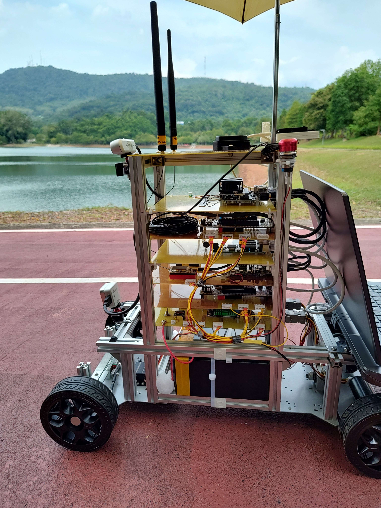
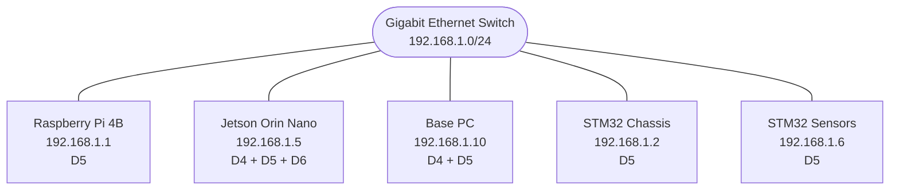
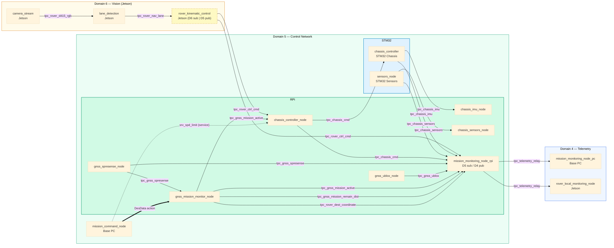

# Almondmatcha - Autonomous Mobile Rover

Distributed ROS2 outdoor autonomous rover with vision-based lane following, centimeter-accurate RTK GNSS, chassis dynamics control, and dual-tier telemetry logging.

## System Overview

{width=600}


**Architecture v4.1 highlights:**
- Tri-domain isolation: Domain 6 (vision), Domain 5 (control), Domain 4 (telemetry)
- Cross-domain telemetry relay: RPi aggregates D5 topics, publishes to D4 at 5 Hz
- Dual CSV logging: RPi per-topic at native rates, Jetson aggregated from D4
- Base station dual-domain: command/action on D5, monitoring on D4
- STM32 memory optimized: 10 D5 participants, ~60% free RAM

## System Architecture

**Platform**: Heterogeneous distributed computing (Raspberry Pi 4B, Jetson Orin Nano, STM32 NUCLEO-F767ZI)  
**Communication**: ROS2 Humble DDS over Gigabit Ethernet with multi-domain isolation  
**Domains**: 4 (base telemetry + Jetson logging), 5 (rover control), 6 (vision, Jetson localhost)

## Hardware

| Component | Hardware | IP | Function |
|-----------|----------|---------|---------|
| **Main** | Raspberry Pi 4B | 192.168.1.1 | Sensor fusion, mission control |
| **Vision** | Jetson Orin Nano 8GB | 192.168.1.5 | Lane detection, navigation |
| **Chassis** | NUCLEO-F767ZI + IKS4A1 | 192.168.1.2 | Motor control, IMU |
| **Sensors** | NUCLEO-F767ZI + SimpleRTK2b | 192.168.1.6 | Encoders, power monitoring |
| **Base** | Linux PC | Variable | Ground station telemetry |
| **GNSS** | Spresense | USB | Standard GPS |
| **RTK GNSS** | u-blox SimpleRTK2b | USB | Centimeter-level positioning |

## Network Architecture



**Domain 4**: Telemetry — `mission_monitoring_node_pc` (Base, display) + `rover_local_monitoring_node` (Jetson, CSV)  
**Domain 5**: Rover control — all 11 nodes: RPi, Jetson, STM32, Base command  
**Domain 6**: Vision — Jetson localhost, camera and lane detection (30 FPS, not visible on network)

## ROS2 Node-Domain Graph



> **Legend:** `───` ROS2 topic (pub/sub) · `═══` ROS2 action (goal/feedback/result) · `╌╌╌` ROS2 service call

## ROS2 Domain Architecture

| Domain | Purpose | Network Scope | Participants | Key Characteristics |
|--------|---------|---------------|--------------|---------------------|
| **4** | Telemetry | Base + Jetson | **2 nodes:**<br>• mission_monitoring_node_pc (Base)<br>• rover_local_monitoring_node (Jetson) | • Read-only telemetry from /tpc_telemetry_relay<br>• No D5 participation (no STM32 memory cost)<br>• Jetson logs CSV at 5 Hz for future DB migration |
| **5** | Control Network | All rover systems + base command | **11 nodes:**<br>• RPi: 7 nodes<br>• Base: 1 node (mission_command_node)<br>• Jetson: 1 node (rover_kinematic_control)<br>• STM32: 2 nodes | • Bidirectional command/control<br>• Action/service communication<br>• Real-time control loops (50 Hz)<br>• STM32 memory optimized (~60% free RAM) |
| **6** | Vision Processing | Jetson localhost | **2 nodes:**<br>• camera_stream<br>• lane_detection | • RGB/Depth streams (30 FPS, 1280×720)<br>• Network isolated (not visible from network)<br>• Lane params relayed to D5 via rover_kinematic_control |

**Base station dual-domain:**
- `mission_command_node` (D5): sends mission goals, calls RPi action/service servers
- `mission_monitoring_node_pc` (D4): subscribes to `/tpc_telemetry_relay`, displays telemetry

**Cross-domain relay:**
- Vision to control: `rover_kinematic_control` (Jetson) bridges D6 `/tpc_rover_nav_lane` → D5 `/tpc_rover_ctrl_cmd`
- Telemetry relay: `mission_monitoring_node_rpi` (RPi) aggregates 10 D5 topics → D4 `/tpc_telemetry_relay` at 5 Hz

**CSV logging (dual-tier):**
- RPi (`mission_monitoring_node_rpi`): 6 per-topic CSV files at native rates (4–50 Hz), stored in `ws_rpi/runs/`
- Jetson (`rover_local_monitoring_node`): unified CSV from D4 relay at 5 Hz, stored in `ws_jetson/runs/`

See [docs/DOMAINS.md](docs/DOMAINS.md) and [docs/CSV_LOGGING.md](docs/CSV_LOGGING.md) for full details.

## Workspace Structure

```
almondmatcha/
├── README.md                          # This file
├── docs/                              # System-level documentation
│   ├── ARCHITECTURE.md                # System architecture & design
│   ├── TOPICS.md                      # Complete topic reference
│   ├── DOMAINS.md                     # Multi-domain architecture details
│   └── LAUNCH_INSTRUCTIONS.md         # Complete system launch guide
│
├── common_ifaces/                     # Shared ROS2 interfaces (messages/actions/services)
│   ├── msgs_ifaces/                   # ChassisCtrl, ChassisIMU, ChassisSensors, SpresenseGNSS, UbloxGNSS, TelemetryRelay
│   ├── action_ifaces/                 # DesData (navigation goals)
│   └── services_ifaces/               # SpdLimit (speed control)
│
├── ws_rpi/                            # Raspberry Pi 4 workspace
│   ├── README.md                      # Build & run instructions
│   ├── build.sh                       # Automated build script
│   ├── launch_rover_tmux.sh          # Tmux-based system launcher
│   └── src/
│       ├── pkg_chassis_control/       # Motor coordination, cruise control
│       ├── pkg_chassis_sensors/       # Sensor data logging (IMU, encoders)
│       ├── pkg_gnss_navigation/       # GPS waypoint navigation
│       ├── pkg_rover_monitoring/      # Telemetry relay publisher, CSV logger
│       └── rover_launch_system/       # ROS2 launch files
│
├── ws_jetson/                         # Jetson Orin Nano workspace
│   ├── README.md                      # Build & run instructions
│   ├── build_clean.sh / build_inc.sh  # Build scripts
│   ├── launch_gui.sh / launch_headless.sh  # Launch scripts
│   ├── vision_navigation/
│   │   ├── vision_navigation_pkg/     # Lane detection, camera stream (Domain 6)
│   │   └── config/                    # YAML configuration
│   └── src/
│       └── rover_monitor_pkg/         # Telemetry CSV logger (Domain 4, Python)
│
├── ws_base/                           # Base station workspace
│   ├── README.md                      # Build & run instructions
│   ├── launch_base_tmux.sh           # Launch script (tmux)
│   └── src/mission_control/           # Mission command, telemetry relay subscriber
│
├── mros2-mbed-chassis-dynamics/       # STM32 motor controller firmware
│   ├── README.md                      # Build & flash instructions
│   ├── build.bash                     # Docker-based build
│   └── workspace/chassis_controller/  # Motor control + IMU tasks
│
├── mros2-mbed-sensors-gnss/           # STM32 sensors firmware
│   ├── README.md                      # Build & flash instructions
│   ├── build.bash                     # Docker-based build
│   └── workspace/sensors_node/        # Encoder + power + GNSS tasks
│
└── runs/logs/                         # Data logging output (CSV files)
```

## Quick Start

### 1. Build All Workspaces

```bash
# STM32 Firmware
cd ~/almondmatcha/mros2-mbed-chassis-dynamics
sudo ./build.bash all NUCLEO_F767ZI chassis_controller
# Flash: Copy build/mros2-mbed.bin to NUCLEO board

cd ~/almondmatcha/mros2-mbed-sensors-gnss
sudo ./build.bash all NUCLEO_F767ZI sensors_node
# Flash: Copy build/mros2-mbed.bin to NUCLEO board

# Raspberry Pi
cd ~/almondmatcha/ws_rpi
./build.sh
source install/setup.bash

# Jetson
cd ~/almondmatcha/ws_jetson
./build_clean.sh
source install/setup.bash

# Base Station
cd ~/almondmatcha/ws_base
colcon build
source install/setup.bash
```

### 2. Network Configuration

Connect all systems to Gigabit Ethernet switch with static IPs (192.168.1.0/24):

```bash
# Raspberry Pi (192.168.1.1)
sudo nmcli con mod "Wired connection 1" ipv4.addresses 192.168.1.1/24 ipv4.method manual
sudo nmcli con up "Wired connection 1"

# Jetson (192.168.1.5)
sudo nmcli con mod "Wired connection 1" ipv4.addresses 192.168.1.5/24 ipv4.method manual
sudo nmcli con up "Wired connection 1"

# Base Station (192.168.1.10)
sudo nmcli con mod "Wired connection 1" ipv4.addresses 192.168.1.10/24 ipv4.method manual
sudo nmcli con up "Wired connection 1"

# STM32 boards (.2, .6): IPs hardcoded in firmware - no configuration needed

# Verify connectivity
ping 192.168.1.1 && ping 192.168.1.5 && ping 192.168.1.2 && ping 192.168.1.6
```

### 3. Launch System

**Optimal sequence (~25s startup):**

```bash
# 1. Power on STM32 boards → wait for "Discovery complete" (~10s)

# 2. Launch Raspberry Pi (Domain 5 - wait 3-5s)
cd ~/almondmatcha/ws_rpi
export ROS_DOMAIN_ID=5
./launch_rover_tmux.sh

# 3. Launch Jetson (Domains 6 + 5 - wait 3-5s)
ssh yupi@192.168.1.5
cd ~/almondmatcha/ws_jetson
# Note: Script handles both Domain 6 (vision) and Domain 5 (control) automatically
./launch_headless.sh

# 4. Launch Base Station (Domains 4 + 5)
cd ~/almondmatcha/ws_base
# Note: Script handles both domains automatically
# - mission_command_node: Domain 5 (commands/actions)
# - mission_monitoring_node_pc: Domain 4 (telemetry display)
./launch_base_tmux.sh
```

**Domain Architecture:**
- **Domain 6:** Jetson vision (camera, lane detection) - localhost isolation, 30 FPS streams
- **Domain 5:** Rover control network + base command node (mission_command_node for actions/services)
- **Domain 4:** Base telemetry display only (mission_monitoring_node_pc for read-only monitoring)

See [docs/LAUNCH_INSTRUCTIONS.md](docs/LAUNCH_INSTRUCTIONS.md) for detailed timing and [docs/DOMAINS.md](docs/DOMAINS.md) for architecture details.

### 4. Verify Operation

```bash
# Set domain for control network
export ROS_DOMAIN_ID=5

# Check all Domain 5 nodes visible (11 nodes expected)
ros2 node list
# Expected: RPi (7), Base (1), Jetson (1), STM32 (2) = 11 total
# RPi: chassis_controller_node, chassis_imu_node, chassis_sensors_node,
#      gnss_spresense_node, gnss_ublox_node, gnss_mission_monitor_node,
#      mission_monitoring_node_rpi
# Base: mission_command_node
# Jetson: rover_kinematic_control
# STM32: chassis_controller, sensors_node
#
# Note: Domain 4 nodes (mission_monitoring_node_pc, rover_local_monitoring_node)
#       are not visible here

# Monitor key topics (all on Domain 5)
ros2 topic hz /tpc_rover_ctrl_cmd     # ~50 Hz (kinematic control cmds from Jetson)
ros2 topic hz /tpc_chassis_cmd        # ~50 Hz (motor commands to STM32)
ros2 topic hz /tpc_chassis_imu        # ~10 Hz (IMU from STM32)
ros2 topic hz /tpc_rover_nav_lane     # ~30 Hz (lane parameters from Jetson)

# Note: Camera topics (/tpc_rover_d415_rgb) run on Domain 6 (Jetson localhost only)
# and won't be visible from other systems
```

## Ending a tmux Session

To gracefully stop all running nodes and close the tmux session:

- **Detach from tmux:**
  Press `Ctrl+b` then `d` (session keeps running in background)

- **Kill the tmux session (stop all nodes):**
  ```bash
  tmux kill-session -t rover         # For ws_rpi
  tmux kill-session -t jetson_vision # For ws_jetson
  tmux kill-session -t base_station  # For ws_base
  ```

- **Reattach to a running session:**
  ```bash
  tmux attach-session -t <session_name>
  ```

## Key Topics

**Domain 5 (Control Network) - Visible Across All Systems:**

| Topic | Rate | Publisher | Description |
|-------|------|-----------|-------------|
| `tpc_rover_ctrl_cmd` | 50 Hz | Jetson (rover_kinematic_control) | Kinematic control commands to RPi |
| `tpc_chassis_cmd` | 50 Hz | RPi (chassis_controller_node) | Motor commands to STM32 |
| `tpc_chassis_imu` | 10 Hz | STM32 (chassis_controller) | IMU accel/gyro data |
| `tpc_chassis_sensors` | 4 Hz | STM32 (sensors_node) | Encoders, voltage, current |
| `tpc_gnss_spresense` | 10 Hz | RPi (gnss_spresense_node) | Standard GPS position |
| `tpc_gnss_ublox` | 10 Hz | RPi (gnss_ublox_node) | RTK GNSS with cm-level accuracy |
| `tpc_rover_nav_lane` | 30 Hz | Jetson (lane_detection) | Lane parameters [theta, b, detected] |
| `tpc_rover_dest_coordinate` | Event | RPi (gnss_mission_monitor_node) | Mission destination waypoint |

**Domain 4 (Base Telemetry) - Base Station Only:**

| Topic | Rate | Publisher | Description |
|-------|------|-----------|-------------|
| `tpc_telemetry_relay` | 5 Hz | RPi (mission_monitoring_node_rpi) | Aggregated rover telemetry (TelemetryRelay.msg) |

**Data logging:** `mission_monitoring_node_rpi` (RPi) logs 6 per-topic CSV files at native rates (4–50 Hz) in `ws_rpi/runs/`. `rover_local_monitoring_node` (Jetson, D4) logs aggregated telemetry at 5 Hz in `ws_jetson/runs/`. See [docs/CSV_LOGGING.md](docs/CSV_LOGGING.md).

**Domain 6 (Vision Processing) - Jetson Localhost Only:**

| Topic | Rate | Publisher | Description |
|-------|------|-----------|-------------|
| `tpc_rover_d415_rgb` | 30 Hz | Jetson (camera_stream) | RGB image stream (1280×720) |
| `tpc_rover_d415_depth` | 30 Hz | Jetson (camera_stream) | Depth image stream |

**Note:** Domain 6 topics are NOT visible from RPi, Base Station, or STM32 boards. Only the processed lane parameters (`tpc_rover_nav_lane`) are published to Domain 5.

See [docs/TOPICS.md](docs/TOPICS.md) for complete reference.

## Documentation

**System-Level:** [ARCHITECTURE.md](docs/ARCHITECTURE.md) | [TOPICS.md](docs/TOPICS.md) | [DOMAINS.md](docs/DOMAINS.md) | [LAUNCH_INSTRUCTIONS.md](docs/LAUNCH_INSTRUCTIONS.md) | [CSV_LOGGING.md](docs/CSV_LOGGING.md)

**Workspace-Level:** [ws_rpi](ws_rpi/README.md) | [ws_jetson](ws_jetson/README.md) | [ws_base](ws_base/README.md) | [STM32 Chassis](mros2-mbed-chassis-dynamics/README.md) | [STM32 Sensors](mros2-mbed-sensors-gnss/README.md)

## Performance Specifications

| Metric | Value |
|--------|-------|
| Vision processing | 30 FPS @ 1280×720 |
| Lane detection | 25-30 FPS |
| Steering control loop | 50 Hz |
| IMU sampling | 10 Hz (published) |
| GNSS update rate | 10 Hz |
| End-to-end vision latency | 100-150 ms |

## Development

**Repository:** RoboticsGG/almondmatcha (main branch) | **License:** Apache 2.0

**Naming Conventions:**
- **C++ Nodes:** Use `*_node` suffix (e.g., `chassis_controller_node.cpp` → executable `chassis_controller_node`)
- **Python Nodes:** Use `*_node.py` suffix (e.g., `camera_stream_node.py`)
- **Topics:** Use `tpc_*` prefix (e.g., `/tpc_chassis_cmd`)
- **Messages:** PascalCase (e.g., `TelemetryRelay.msg`)
- **Services:** Use `srv_*` prefix
- **Actions:** Use camelCase suffix `Data` (e.g., `DesData.action`)

**Contributing:** Follow ROS2 naming conventions (`*_node` suffix for C++ nodes, `*_node.py` for Python, `tpc_*` for topics), write descriptive commits, update documentation for architectural changes, test on all platforms before merging.

## Troubleshooting


**STM32 not visible:**
```bash
# Verify switch connectivity
ethtool eth0  # Link detected: yes
ping 192.168.1.2 && ping 192.168.1.6
arp -a  # Should show all systems
# Check serial console (115200 baud) for network errors
```

## Monitoring STM32 Boards with minicom

You can monitor the serial output of both STM32 boards (chassis and sensors) using `minicom` on any Linux PC. This is useful for debugging firmware, checking network status, and viewing real-time logs.

### 1. Identify Serial Ports

Plug each NUCLEO-F767ZI board into your PC via USB. List available serial devices:

```bash
ls /dev/ttyACM*
```

Typical output (with two boards):

```
/dev/ttyACM0  /dev/ttyACM1
```

Unplug/replug each board to determine which port corresponds to chassis or sensors firmware.

### 2. Start minicom

Open a terminal for each board and run:

```bash
sudo minicom -D /dev/ttyACM0 -b 115200
```

Replace `/dev/ttyACM0` with the correct port for each board. The default baud rate is **115200**.

### 3. Typical Output

You should see boot messages, network discovery, and real-time logs from the firmware. Example:

```
[mros2] Discovery complete. IP: 192.168.1.2
[chassis] Motor enabled. IMU OK.
```

### 4. Exit minicom

Press `Ctrl+A` then `X` to exit minicom.

**Tip:** You can run minicom in multiple terminals to monitor both boards simultaneously.

**ROS2 topics not visible:**
```bash
echo $ROS_DOMAIN_ID  # Must be 5
ros2 multicast send/receive  # Test switch multicast support
sudo ufw allow from 192.168.1.0/24  # Allow DDS traffic
ros2 daemon stop && ros2 daemon start
```

**Vision node errors:**
```bash
rs-enumerate-devices  # Verify D415 detected
# Ensure USB 3.0 port, check /dev/video* permissions
```

See workspace README files for detailed troubleshooting.

## Future Enhancements

- Extended Kalman Filter (EKF) for multi-sensor fusion
- Autonomous obstacle avoidance with depth camera
- Path planning with GNSS waypoint navigation
- Database backend for Jetson telemetry logging (SQLite/PostgreSQL replacing CSV)
- Web-based telemetry dashboard from D4 relay stream
- Multi-rover coordination

---

**Last Updated:** February 26, 2026  
**Version:** 4.1 (Tri-domain, dual CSV logging, rover_monitor_pkg on Jetson)
