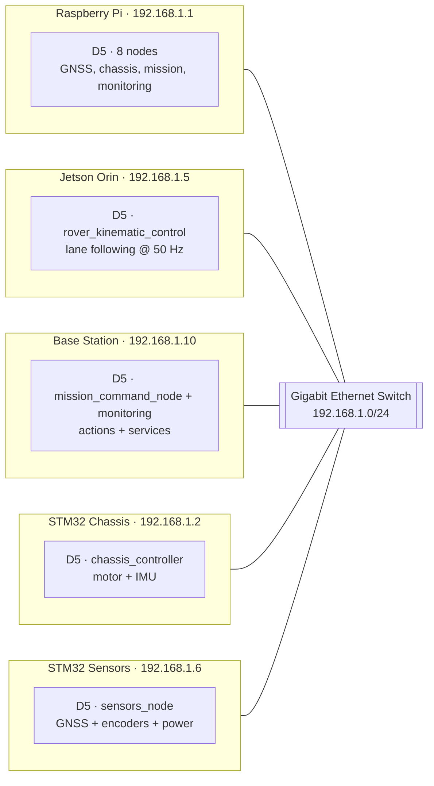
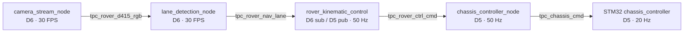

# System Architecture

Almondmatcha rover system architecture: distributed heterogeneous computing with ROS2 DDS communication.

## Overview

**Design Philosophy:** Modular, distributed architecture with specialized computing nodes

**Key Principles:**
- Separation of concerns (vision, control, sensing)
- Real-time performance on resource-constrained embedded systems
- Centralized sensor fusion for autonomous capabilities
- Scalable network topology

## System Diagram

> **Branch: `single-domain`** — All workspaces (ws_rpi, ws_jetson, ws_base) run on **ROS_DOMAIN_ID=5**. D4 and D6 do not exist in this branch.

The rover uses **one DDS domain (D5)**: all nodes on all machines communicate on the same domain.



## Hardware Architecture

### Computing Nodes

| Node | Hardware | CPU | RAM | Storage | Network |
|------|----------|-----|-----|---------|---------|
| **Jetson** | Orin Nano 8GB | ARM Cortex-A78AE (6-core) + Ampere GPU | 8 GB | 128 GB eMMC | Gigabit Ethernet |
| **RPi** | Raspberry Pi 4B | ARM Cortex-A72 (4-core) | 4-8 GB | 64 GB SD | Gigabit Ethernet |
| **Chassis** | NUCLEO-F767ZI | ARM Cortex-M7 @ 216 MHz | 512 KB SRAM | 2 MB Flash | 100 Mbps Ethernet |
| **Sensors** | NUCLEO-F767ZI | ARM Cortex-M7 @ 216 MHz | 512 KB SRAM | 2 MB Flash | 100 Mbps Ethernet |

### Sensor Suite

**Vision:**
- Intel RealSense D415 RGB-D camera (1280×720 @ 30 FPS)
  - RGB stream for lane detection
  - Depth stream (reserved for obstacle avoidance)

**Navigation:**
- Sony Spresense GNSS (USB to RPi) - 10 Hz position updates
- SimpleRTK2b RTK GNSS (UART to STM32 sensors) - centimeter-level accuracy

**Motion Sensing:**
- LSM6DSV16X 6-axis IMU (I2C to STM32 chassis) - 100 Hz sampling
  - 3-axis accelerometer
  - 3-axis gyroscope
- Quadrature encoders on both drive motors - 10 Hz odometry

**Power Monitoring:**
- INA226 voltage/current sensor (I2C to STM32 sensors)

## Software Architecture

### Single-Domain Architecture (D5 only)

**Domain 5 (All nodes):** Network-wide, ~16 participants
- ws_rpi (8) + ws_base (2) + ws_jetson (1) + STM32 (2) = 16 nodes on one domain
- All monitoring, vision relay, and control traffic share D5
- STM32 firmware configured for `MAX_NUM_PARTICIPANTS=20`

**Rationale (POC):** Collapse D4+D5+D6 into D5 to measure latency, jitter, and STM32 memory impact of a flat topology versus the main-branch multi-domain architecture.

### Node Distribution

**Raspberry Pi 4 (192.168.1.1 — D5):**
```
├── chassis_controller_node     - Motor command coordination
├── chassis_imu_node            - IMU data relay (sub STM32)
├── chassis_sensors_node        - Encoder/power relay (sub STM32)
├── gnss_spresense_node         - Standard GPS position processing
├── gnss_ublox_node             - RTK GNSS centimeter-level processing
├── gnss_mission_monitor_node   - Waypoint navigation state machine
├── mission_monitoring_node_rpi - Aggregates D5 topics + CSV logging
└── rover_monitoring_node       - CSV data logger (all topics)
```

**Jetson Orin Nano (192.168.1.5 — D5):**
```
Domain 5 (all nodes):
├── camera_stream_node      - D415 RGB/depth streaming @ 30 FPS (published to D5)
├── lane_detection_node     - Lane feature extraction @ 30 FPS (published to D5)
└── rover_kinematic_control - Bicycle-model PID: steering + speed @ 50 Hz
    ├── Sub: tpc_rover_nav_lane (D5)
    └── Pub: tpc_rover_ctrl_cmd [steer_angle, speed_cmd, detected] (D5)
```

**STM32 Chassis (192.168.1.2):**
```
Domain 5 (mROS2):
├── Motor Control Task - 50 ms @ High Priority
│   └── Subscribes: tpc_chassis_cmd
└── IMU Reader Task - 10 ms @ Normal Priority
    └── Publishes: tpc_chassis_imu @ 10 Hz
```

**STM32 Sensors (192.168.1.6):**
```
Domain 5 (mROS2):
├── Encoder Task - 100 ms
├── Power Monitor Task - 200 ms
├── GNSS Reader Task - 100 ms
└── Publishes: tpc_chassis_sensors @ 4 Hz (aggregated)
```

## Data Flow Architecture

### Vision-Based Lane Following



**Latency Budget:**
- Camera capture: 33 ms
- Lane detection: 30-40 ms
- Steering control: 20 ms (50 Hz cycle)
- Chassis command: 20 ms (50 Hz cycle)
- Motor actuation: 50 ms (20 Hz cycle)
- **Total end-to-end: 100-150 ms**

### Message Flow Patterns

**Publish-Subscribe:**
- Vision stream: camera → lane_detection_node
- Sensor data: STM32s → RPi logging nodes
- Control commands: rover_kinematic_control → chassis_controller

**Request-Response (Services):**
- Speed limit updates: base station → chassis controller
- Navigation goals: base station → mission monitor

**Action (Goal-Based):**
- Destination waypoints: base station → mission monitor
- Feedback: remaining distance

## Communication Architecture

### Network Topology

| Device | IP | SSH | Domains | Role |
|--------|-----|-----|---------|------|
| Raspberry Pi | 192.168.1.1 | `curry@192.168.1.1` | D5 (8 nodes) | Coordination, sensing, mission, monitoring |
| Jetson Orin | 192.168.1.5 | `yupi@192.168.1.5` | D5 (3 nodes) | Vision processing, kinematic control |
| Base Station | 192.168.1.10 | `yupi@192.168.1.10` | D5 (2 nodes) | Mission command, telemetry monitoring |
| STM32 Chassis | 192.168.1.2 | — (mROS2) | D5 only | Motor control, IMU |
| STM32 Sensors | 192.168.1.6 | — (mROS2) | D5 only | GNSS, encoders, power |

**DDS:** Fast-RTPS on Linux; embeddedRTPS (mROS2) on STM32. Multicast discovery on 239.255.0.1, UDP 7400–7500. Critical commands use Reliable QoS; high-frequency sensor streams use Best-Effort.

## Storage Architecture

### Data Logging

**Primary — RPi** (`mission_monitoring_node_rpi`, ws_rpi/runs/run_NNN_YYYYMMDD_HHMMSS/):
- `rtk_gnss.csv` — RTK position, ~10 Hz
- `spresense_gnss.csv` — Spresense GPS, ~10 Hz
- `chassis_imu.csv` — Accel/gyro, ~10 Hz
- `chassis_sensors.csv` — Encoders, voltage, current, ~4 Hz
- `chassis_cmd.csv` — Motor commands, ~50 Hz
- `mission_state.csv` — Event-driven mission status

**Secondary — Jetson** (`rover_local_monitoring_node`, ws_jetson/runs/run_NNN_YYYYMMDD_HHMMSS/):
- `telemetry_unified.csv` — All fields, 5 Hz
- `rtk_gnss.csv`, `spresense_gnss.csv`, `chassis_data.csv`, `mission_state.csv` — 5 Hz
- Future: replaces CSV with SQLite/PostgreSQL backend

See [CSV_LOGGING.md](CSV_LOGGING.md) for full schema and analysis guidance.

### Configuration Storage

**YAML Configuration (Jetson):**
- `vision_nav_gui.yaml` / `vision_nav_headless.yaml`
- `steering_control_params.yaml`

**Hardcoded (STM32):**
- Network: IP, netmask, gateway in `mros2-platform.h`
- Sensors: Pins, I2C addresses in workspace apps

## Scalability

- Vision/AI nodes: add to Domain 6 — zero STM32 impact.
- Control nodes: add to Domain 5; monitor `ros2 node list | wc -l` against `MAX_NUM_PARTICIPANTS`.
- Additional computing boards: assign a static IP in 192.168.1.0/24, set `ROS_DOMAIN_ID=5`.

## Performance Characteristics

| Subsystem | Metric | Value |
|-----------|--------|-------|
| Vision | Processing latency | 30–40 ms |
| Vision | Frame rate | 30 FPS |
| Control | Steering update rate | 50 Hz |
| Control | Motor command latency | 20 ms |
| Sensors | IMU sample rate | 10 Hz |
| Sensors | GNSS update rate | 10 Hz |
| Network | End-to-end latency | <50 ms (Domain 5) |

---

**See Also:** [TOPICS.md](TOPICS.md) · [DOMAINS.md](DOMAINS.md)