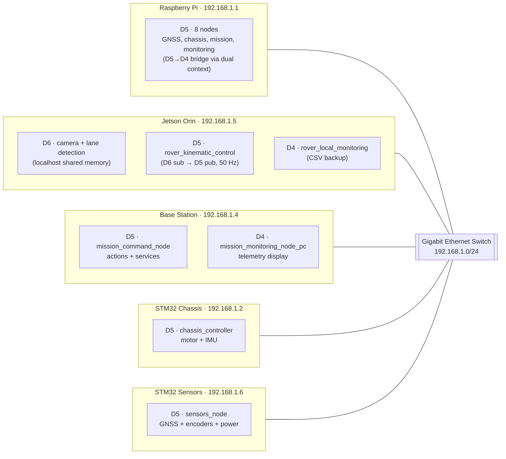
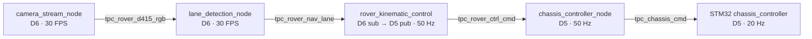
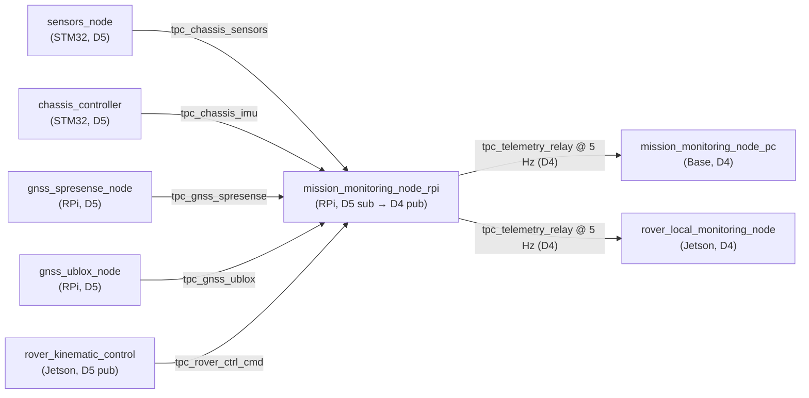

# System Architecture

Almondmatcha rover system architecture: distributed heterogeneous computing with ROS2 DDS communication.

## Overview

**Design Philosophy:** Modular, distributed architecture with specialized computing nodes

**Key Principles:**
- Separation of concerns (vision, control, sensing)
- Real-time performance on resource-constrained embedded systems
- Centralized sensor fusion for autonomous capabilities
- Scalable network topology

## System Diagram

> **Branch: `multi-domain`** — Tri-domain architecture: D4 (telemetry), D5 (control/STM32), D6 (vision). See the `single-domain` branch for the all-D5 POC variant.

The rover uses **three DDS domains** to separate traffic by purpose:



## Hardware Architecture

### Computing Nodes

| Node | Hardware | CPU | RAM | Storage | Network |
|------|----------|-----|-----|---------|---------|
| **Jetson** | Orin Nano 8GB | ARM Cortex-A78AE (6-core) + Ampere GPU | 8 GB | 128 GB eMMC | Gigabit Ethernet |
| **RPi** | Raspberry Pi 4B | ARM Cortex-A72 (4-core) | 4-8 GB | 64 GB SD | Gigabit Ethernet |
| **Chassis** | NUCLEO-F767ZI | ARM Cortex-M7 @ 216 MHz | 512 KB SRAM | 2 MB Flash | 100 Mbps Ethernet |
| **Sensors** | NUCLEO-F767ZI | ARM Cortex-M7 @ 216 MHz | 512 KB SRAM | 2 MB Flash | 100 Mbps Ethernet |

### Sensor Suite

**Vision:**
- Intel RealSense D415 RGB-D camera (1280×720 @ 30 FPS)
  - RGB stream for lane detection
  - Depth stream (reserved for obstacle avoidance)
  - Configurable `device_serial` parameter (default: `806312060441`)
  - Automatic `fallback_video` to local video file if camera unavailable

**Navigation:**
- Sony Spresense GNSS (USB to RPi) - 10 Hz position updates
- SimpleRTK2b RTK GNSS (UART to STM32 sensors) - centimeter-level accuracy

**Motion Sensing:**
- LSM6DSV16X 6-axis IMU (I2C to STM32 chassis) - 100 Hz sampling
  - 3-axis accelerometer
  - 3-axis gyroscope
- Quadrature encoders on both drive motors - 10 Hz odometry

**Power Monitoring:**
- INA226 voltage/current sensor (I2C to STM32 sensors)

## Software Architecture

### Multi-Domain Architecture (D4 / D5 / D6)

| Domain | Purpose | Network Scope | Participants | Key Characteristics |
|--------|---------|---------------|--------------|---------------------|
| **D4** | Telemetry relay | RPi (pub) → Base + Jetson (sub) | 3 nodes | Low-rate aggregated telemetry relay (5 Hz) |
| **D5** | Control network | RPi + Base + STM32 + Jetson (kinematic pub) | ~12 nodes | Command/control, GNSS, STM32 IMU/sensors |
| **D6** | Vision processing | Jetson localhost only | 2 nodes | High-bandwidth camera/lane images (30 FPS), shared memory |

**Design Rationale:**
- **D6 isolation:** Camera images (30 FPS, ~10 MB/s) stay on Jetson localhost via shared memory — never hit the network or STM32
- **D5 control:** STM32 boards only see control-loop participants (~12), reducing SPDP/SEDP load
- **D4 telemetry:** Low-rate relay (~5 Hz) avoids mixing monitoring traffic with time-critical control
- STM32 firmware configured for `SPDP_MAX_NUMBER_FOUND_PARTICIPANTS=30` (18 spare slots)

### Cross-Domain Bridges (no separate processes)

| Bridge | Node | Mechanism |
|--------|------|-----------|
| D5 → D4 | `mission_monitoring_node_rpi` | Dual rclcpp context — subscribes all D5 topics, publishes `tpc_telemetry_relay` on D4 at 5 Hz |
| D6 → D5 | `rover_kinematic_control` | Dual rclpy context — subscribes `tpc_rover_nav_lane` on D6, publishes `tpc_rover_ctrl_cmd` on D5 |

### Node Distribution (16 nodes total)

**Raspberry Pi 4 (192.168.1.1) — 8 nodes, all on D5:**
```
├── chassis_controller_node     - Motor command coordination (sub ctrl_cmd → pub chassis_cmd)
├── chassis_imu_node            - IMU data relay (sub tpc_chassis_imu from STM32)
├── chassis_sensors_node        - Encoder/power relay (sub tpc_chassis_sensors from STM32)
├── gnss_spresense_node         - Spresense GPS via USB serial (pub tpc_gnss_spresense @ 10 Hz)
├── gnss_ublox_node             - RTK GNSS via STM32 UART relay (pub tpc_gnss_ublox @ 10 Hz)
├── gnss_mission_monitor_node   - Waypoint navigation state machine + action server /des_data
├── mission_monitoring_node_rpi - Dual-context: D5 sub → D4 pub (tpc_telemetry_relay @ 5 Hz)
└── rover_monitoring_node       - CSV data logger (subscribes 8 D5 topics)
```

**Jetson Orin Nano (192.168.1.5) — 4 nodes across 3 domains:**
```
Domain 6 (localhost, shared memory):
├── camera_stream_node          - D415 RGB/depth streaming @ 30 FPS
│   └── Params: device_serial, fallback_video (auto-fallback to video file)
└── lane_detection_node         - Lane feature extraction @ 25-30 FPS

Domain 5 (network, via dual context):
└── rover_kinematic_control     - Bicycle-model PID: D6 sub → D5 pub
    ├── Sub: tpc_rover_nav_lane (D6, shared memory)
    └── Pub: tpc_rover_ctrl_cmd [steer_angle, speed_cmd, detected] (D5, network)

Domain 4 (network):
└── rover_local_monitoring_node - CSV backup logger (sub tpc_telemetry_relay @ 5 Hz)
```

**Base Station (192.168.1.4) — 2 nodes on separate domains:**
```
Domain 5:
└── mission_command_node        - Action client /des_data + service client /srv_spd_limit

Domain 4:
└── mission_monitoring_node_pc  - Telemetry display (sub tpc_telemetry_relay)
```

**STM32 Chassis (192.168.1.2) — D5 only:**
```
Domain 5 (mROS2 / embeddedRTPS):
├── Motor Control Task - 50 ms @ High Priority
│   └── Subscribes: tpc_chassis_cmd
└── IMU Reader Task - 10 ms @ Normal Priority
    └── Publishes: tpc_chassis_imu @ 10 Hz
```

**STM32 Sensors (192.168.1.6) — D5 only:**
```
Domain 5 (mROS2 / embeddedRTPS):
├── Encoder Task - 100 ms
├── Power Monitor Task - 200 ms
├── GNSS Reader Task - 500 ms
└── Publishes: tpc_chassis_sensors @ 4 Hz (aggregated)
```

## Data Flow Architecture

### Vision-Based Lane Following (D6 → D5)



**Latency Budget:**
- Camera capture: 33 ms
- Lane detection: 30-40 ms
- Steering control: 20 ms (50 Hz cycle)
- Chassis command: 20 ms (50 Hz cycle)
- Motor actuation: 50 ms (20 Hz cycle)
- **Total end-to-end: 100-150 ms**

### Telemetry Relay (D5 → D4)



### Message Flow Patterns

**Publish-Subscribe:**
- Vision stream: camera → lane_detection_node (D6 shared memory)
- Sensor data: STM32s → RPi logging nodes (D5 network)
- Control commands: rover_kinematic_control → chassis_controller (D5 network)
- Telemetry: RPi → Base + Jetson (D4 network)

**Request-Response (Services):**
- Speed limit updates: base station → chassis controller (D5)

**Action (Goal-Based):**
- Destination waypoints: base station → mission monitor (D5)
- Feedback: remaining distance

## Communication Architecture

### Network Topology

| Device | IP | SSH | Domains | Nodes | Role |
|--------|-----|-----|---------|-------|------|
| Raspberry Pi | 192.168.1.1 | `curry@192.168.1.1` | D5 (8), D4 pub (internal) | 8 | Coordination, sensing, mission, monitoring |
| Jetson Orin | 192.168.1.5 | `yupi@192.168.1.5` | D6 (2), D5 (1), D4 (1) | 4 | Vision processing, kinematic control, CSV backup |
| Base Station | 192.168.1.4 | `yupi@192.168.1.4` | D5 (1), D4 (1) | 2 | Mission command, telemetry monitoring |
| STM32 Chassis | 192.168.1.2 | — (mROS2) | D5 only | 1 | Motor control, IMU |
| STM32 Sensors | 192.168.1.6 | — (mROS2) | D5 only | 1 | GNSS, encoders, power |

**DDS:** Fast-RTPS on Linux; embeddedRTPS (mROS2) on STM32. Multicast discovery on 239.255.0.1, UDP 7400–7500. Critical commands use Reliable QoS; high-frequency sensor streams use Best-Effort.

## Storage Architecture

### Data Logging

**Primary — RPi** (`rover_monitoring_node`, ws_rpi/runs/run_NNN_YYYYMMDD_HHMMSS/):
- `rtk_gnss.csv` — RTK position, ~10 Hz
- `spresense_gnss.csv` — Spresense GPS, ~10 Hz
- `chassis_imu.csv` — Accel/gyro, ~10 Hz
- `chassis_sensors.csv` — Encoders, voltage, current, ~4 Hz
- `chassis_cmd.csv` — Motor commands, ~50 Hz
- `mission_state.csv` — Event-driven mission status

**Secondary — Jetson** (`rover_local_monitoring_node`, D4, ws_jetson/runs/run_NNN_YYYYMMDD_HHMMSS/):
- `telemetry_unified.csv` — All fields, 5 Hz
- `rtk_gnss.csv`, `spresense_gnss.csv`, `chassis_data.csv`, `mission_state.csv` — 5 Hz

See [CSV_LOGGING.md](CSV_LOGGING.md) for full schema and analysis guidance.

### Configuration Storage

**YAML Configuration (Jetson):**
- `vision_nav_gui.yaml` / `vision_nav_headless.yaml`
- `steering_control_params.yaml`

**Hardcoded (STM32):**
- Network: IP, netmask, gateway in `mros2-platform.h`
- Sensors: Pins, I2C addresses in workspace apps

## Scalability

- Vision/AI nodes: add to Domain 6 — zero STM32 impact (shared memory, localhost only)
- Control nodes: add to Domain 5; monitor `ros2 node list | wc -l` against `SPDP_MAX_NUMBER_FOUND_PARTICIPANTS`
- Telemetry consumers: add to Domain 4 — no D5 impact
- Additional computing boards: assign a static IP in 192.168.1.0/24, set appropriate `ROS_DOMAIN_ID`

## Performance Characteristics

| Subsystem | Metric | Value |
|-----------|--------|-------|
| Vision | Processing latency | 30–40 ms |
| Vision | Frame rate | 30 FPS |
| Control | Steering update rate | 50 Hz |
| Control | Motor command latency | 20 ms |
| Sensors | IMU sample rate | 10 Hz |
| Sensors | GNSS update rate | 10 Hz |
| Network | End-to-end latency | <50 ms (Domain 5) |

---

**See Also:** [TOPICS.md](TOPICS.md) · [DOMAINS.md](DOMAINS.md)
