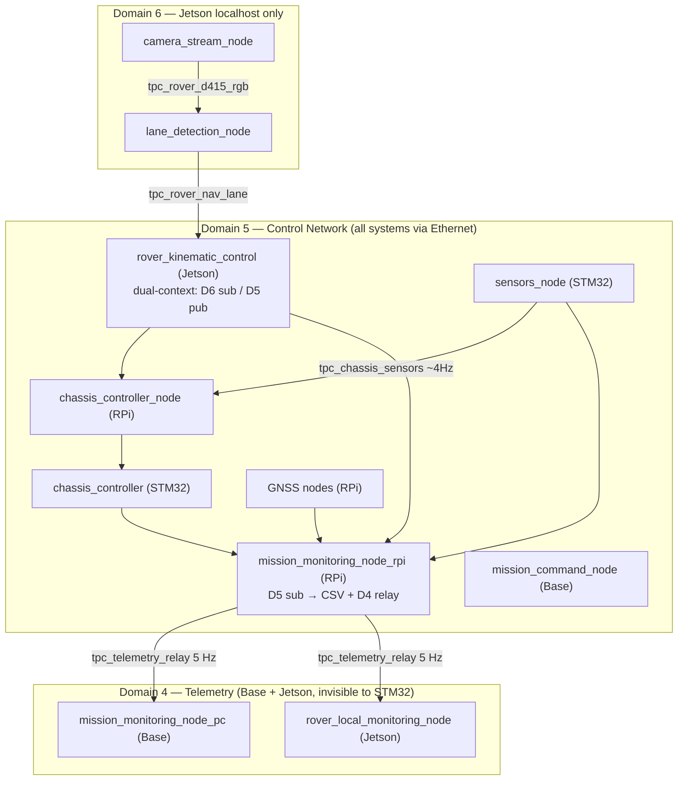

# ROS2 Domain Architecture

Tri-domain architecture: D4 (telemetry), D5 (control), D6 (vision). Minimises STM32
DDS participant count while isolating high-bandwidth vision and unidirectional monitoring
traffic from the control network.

## Domain Assignment

| Domain | Purpose | Scope | Participants |
|--------|---------|-------|-------------|
| **4** | Telemetry relay | Base + Jetson | `mission_monitoring_node_pc` (Base), `rover_local_monitoring_node` (Jetson) — subscribe `/tpc_telemetry_relay` @ 5 Hz; invisible to STM32 |
| **5** | Control network | All systems via Ethernet | RPi (7 nodes), Base (`mission_command_node`), Jetson (`rover_kinematic_control`), STM32 (2 nodes) = **11 total** |
| **6** | Vision processing | Jetson localhost only | `camera_stream_node`, `lane_detection_node` — 30 FPS, never on network |

## Architecture

## Design Rationale

**D6 isolation (D5 count: 13→11):** Vision traffic (30 FPS RGB+depth) on D5 would consume STM32 proxy
slots per participant. Moving camera and lane-detection to D6 localhost frees ~2 proxy entries and
eliminates high-frequency SPDP churn from Jetson vision nodes. Result: ~60% free RAM on STM32.

**D4 relay (D5 count: 11, stable):** Base telemetry display and Jetson CSV logger are monitoring-only.
Moving them to D4 means zero STM32 RAM cost. `mission_monitoring_node_rpi` aggregates all D5 topics
and publishes a single `/tpc_telemetry_relay` message to D4 at 5 Hz (one participant serves all consumers).

**Cross-domain links (no bridge process needed):**
- Vision → control: `rover_kinematic_control` runs a single process with two rclcpp contexts (D6 subscriber + D5 publisher)
- Control → telemetry: `mission_monitoring_node_rpi` runs two contexts (D5 subscriber + D4 publisher)

---

**See Also:** [ARCHITECTURE.md](ARCHITECTURE.md) · [TOPICS.md](TOPICS.md) · [CSV_LOGGING.md](CSV_LOGGING.md)
