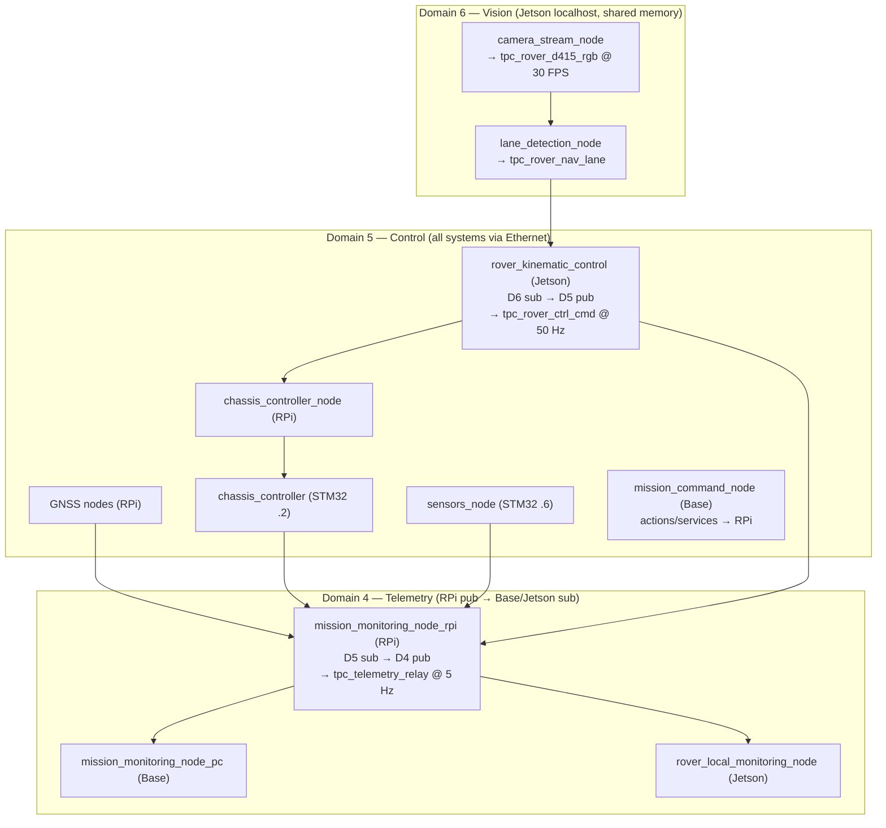

# ROS2 Domain Architecture

> **Branch: `multi-domain`** — Original tri-domain architecture: D4 (telemetry), D5 (control/STM32), D6 (vision). All STM32 patches and experiment tooling from `single-domain` branch included. See the `single-domain` branch for the all-D5 POC variant.

The rover uses a **tri-domain architecture** to separate traffic by purpose:

## Domain Assignment

| Domain | Purpose | Network Scope | Participants | Key Characteristics |
|--------|---------|---------------|--------------|---------------------|
| **4** | Telemetry relay | RPi (pub) → Base + Jetson (sub) | 3 nodes | Low-rate aggregated telemetry relay (5 Hz) |
| **5** | Control network | RPi + Base + STM32 + Jetson (kinematic pub) | ~12 nodes | Command/control, GNSS, STM32 IMU/sensors |
| **6** | Vision processing | Jetson localhost only | 2 nodes | High-bandwidth camera/lane images (30 FPS), shared memory |

## Architecture Overview



## Design Rationale

**Tri-domain goals:**
- **D6 isolation:** Camera images (30 FPS, ~10 MB/s) stay on Jetson localhost via shared memory — never hit the network or STM32
- **D5 control:** STM32 boards only see control-loop participants, reducing SPDP/SEDP load
- **D4 telemetry:** Low-rate relay (~5 Hz) avoids mixing monitoring traffic with time-critical control

**Key cross-domain nodes (no bridge processes needed):**
- `mission_monitoring_node_rpi` — dual rclcpp context: D5 subscriber, D4 publisher (hardcoded in C++)
- `rover_kinematic_control` — dual rclpy context: D6 subscriber, D5 publisher (hardcoded in Python)


## Domain Configuration

### Domain 5: Control Loop

**ws_rpi (Raspberry Pi) — all 8 nodes on D5:**
```bash
export ROS_DOMAIN_ID=5
export FASTRTPS_DEFAULT_PROFILES_FILE=~/almondmatcha/ws_rpi/fastdds_rover.xml
cd ~/almondmatcha/ws_rpi && source install/setup.bash
./launch_rover_multi_domain.sh
```

**ws_base (Base Station) — mission_command on D5:**
```bash
export ROS_DOMAIN_ID=5
export FASTRTPS_DEFAULT_PROFILES_FILE=~/almondmatcha/ws_base/fastdds_base.xml
cd ~/almondmatcha/ws_base && source install/setup.bash
./launch_base_multi_domain.sh
```

**STM32 Firmware (both boards):**
```cpp
// In platform/rtps/config.h
const uint8_t DOMAIN_ID = 5;
```

### Domain 6: Vision Processing (Jetson)

```bash
# No FASTRTPS_DEFAULT_PROFILES_FILE — uses default DDS with shared memory
export ROS_DOMAIN_ID=6
cd ~/almondmatcha/ws_jetson && source install/setup.bash
# camera_stream_node and lane_detection_node launched by launch_jetson_multi_domain.sh
```

### Domain 4: Telemetry Relay

```bash
# mission_monitoring_node_pc on base, rover_local_monitoring_node on Jetson
export ROS_DOMAIN_ID=4
# No FASTRTPS_DEFAULT_PROFILES_FILE needed — no STM32 on D4
```

## Cross-Domain Communication

Two nodes bridge domains using dual rclcpp/rclpy contexts — no separate bridge processes.

**RPi: D5 → D4 relay (`mission_monitoring_node_rpi`):**
1. Subscribes to all D5 telemetry topics (chassis, GNSS, vision commands)
2. Aggregates into `tpc_telemetry_relay` message at 5 Hz
3. Publishes on D4 → received by Base PC and Jetson monitoring nodes

**Jetson: D6 → D5 relay (`rover_kinematic_control`):**
1. Subscribes to `tpc_rover_nav_lane` on D6 (localhost, shared memory)
2. Runs bicycle-model PID controller
3. Publishes `tpc_rover_ctrl_cmd` on D5 (network, to RPi chassis_controller)

## Verifying Domain Configuration

### Check Domain 5 Nodes

```bash
export ROS_DOMAIN_ID=5
ros2 node list

# Expected (~11 nodes):
/chassis_controller_node        # ws_rpi
/gnss_mission_monitor_node      # ws_rpi
/gnss_spresense_node            # ws_rpi
/gnss_ublox_node                # ws_rpi
/chassis_imu_node               # ws_rpi
/chassis_sensors_node           # ws_rpi
/mission_monitoring_node_rpi    # ws_rpi (D5 sub side)
/rover_monitoring_node          # ws_rpi (CSV logger)
/rover_kinematic_control        # ws_jetson (D5 pub side)
/chassis_controller             # STM32 chassis-dynamics
/sensors_node                   # STM32 sensors-gnss
/mission_command_node           # ws_base
```

### Check Domain 4 Nodes

```bash
export ROS_DOMAIN_ID=4
ros2 node list

# Expected (3 nodes):
/mission_monitoring_domain4_pub  # RPi internal D4 publisher
/mission_monitoring_node_pc      # ws_base (telemetry display)
/rover_local_monitoring_node     # ws_jetson (CSV logger)
```

### Check Domain 6 Nodes

```bash
export ROS_DOMAIN_ID=6
ros2 node list

# Expected (2-3 nodes, Jetson localhost only):
/camera_stream_node             # ws_jetson
/lane_detection_node            # ws_jetson
/rover_kinematic_control        # ws_jetson (D6 sub side)
```

### Check Cross-Domain Communication

**From Jetson:**
```bash
# Check Domain 6 vision topics
export ROS_DOMAIN_ID=6
ros2 topic echo /tpc_rover_nav_lane

# Check Domain 5 control output
export ROS_DOMAIN_ID=5
ros2 topic echo /tpc_rover_ctrl_cmd
```

---

## Telemetry Relay Implementation

### Domain 4 Subscribers

Two nodes subscribe to `/tpc_telemetry_relay` on Domain 4:

**`mission_monitoring_node_pc` (Base station):** real-time telemetry display. Runs entirely in D4 — no D5 participation, never counted in STM32 discovery.

**`rover_local_monitoring_node` (Jetson):** secondary CSV logging at 5 Hz in `ws_jetson/runs/run_NNN_YYYYMMDD_HHMMSS/`. Future: replace CSV writer with SQLite/PostgreSQL. Runs entirely in D4.

### Dual-Context Pattern (RPi)

`mission_monitoring_node_rpi` creates two ROS2 contexts in one process:

```cpp
// Domain 5 context — for subscriptions (all sensor/command topics)
auto d5_init = rclcpp::InitOptions();
d5_init.set_domain_id(5);
auto d5_ctx = std::make_shared<rclcpp::Context>();
d5_ctx->init(argc, argv, d5_init);

// Domain 4 context — for publishing telemetry relay
auto d4_init = rclcpp::InitOptions();
d4_init.set_domain_id(4);
auto d4_ctx = std::make_shared<rclcpp::Context>();
d4_ctx->init(argc, argv, d4_init);

// MultiThreadedExecutor spins both nodes
rclcpp::executors::MultiThreadedExecutor exec;
exec.add_node(node);               // D5 subscriber node
exec.add_node(node->d4_pub_node_); // D4 publisher node
exec.spin();
```

### TelemetryRelay.msg

Published at 5 Hz on `/tpc_telemetry_relay` (Domain 4, ~280 bytes/message):
- Header (timestamp)
- Mission: `mission_active`, `distance_remaining_km`
- RTK GNSS: lat/lon/alt, fix quality, centimeter error, validity flag
- Spresense GNSS: lat/lon/alt, validity flag
- Chassis: encoders, voltage, current, power
- IMU: accel xyz, gyro xyz
- Commands: chassis cmd left/right speed & direction
- Navigation: `steering_command`, `lane_theta`, `lane_b`, `lane_detected`
- Destination: lat/lon

See [`common_ifaces/msgs_ifaces/msg/TelemetryRelay.msg`](../common_ifaces/msgs_ifaces/msg/) for full definition.

## Troubleshooting

**Base station sees no telemetry:**
1. `echo $ROS_DOMAIN_ID` on base — should be 4
2. RPi node running: `ROS_DOMAIN_ID=5 ros2 node list | grep mission_monitoring_node_rpi`
3. Network: `ping 192.168.1.1` from base

**RPi monitoring node missing from D5:**
1. Build: `colcon build --packages-select rover_monitoring`
2. Check executor running both contexts (no crash in D4 context init)
3. Verify ROS2 Humble+ (multi-domain context requires Humble or later)

**High CPU on RPi:**
Expected ~5–10% for 5 Hz D4 publishing. If higher, check for topic storms or QoS mismatches on D5 subscriptions.

---

**See Also:** [ARCHITECTURE.md](ARCHITECTURE.md) · [TOPICS.md](TOPICS.md)
