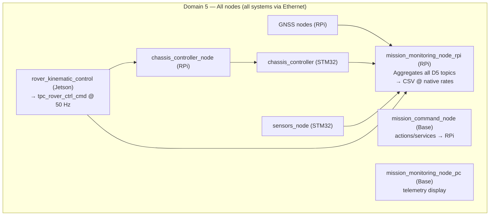

# ROS2 Domain Architecture

> **Branch: `single-domain`** — All workspaces run on **ROS_DOMAIN_ID=5**. This branch is a POC to evaluate the impact of collapsing D4+D5+D6 into a single domain. See the `main` branch for the original tri-domain architecture.

The rover uses a **single-domain architecture**: Domain 5 for all nodes on all machines. The design maximises simplicity and measures overhead impact on STM32 memory and topic latency.

## Domain Assignment

| Domain | Purpose | Network Scope | Participants | Key Characteristics |
|--------|---------|---------------|--------------|---------------------|
| **5** | All communication | All rover systems | **~16 nodes:**<br>• RPi: 8 nodes<br>• Base: 2 nodes<br>• Jetson: 3 nodes<br>• STM32: 2 (chassis, sensors) | • Bidirectional command/control<br>• Monitoring and logging on same domain<br>• Vision relay on same domain<br>• STM32 firmware: `MAX_NUM_PARTICIPANTS=20` |

## Architecture Overview



## Design Rationale

**Single-domain POC goal:** All D4+D5+D6 traffic collapsed to D5 to measure:
- STM32 SRAM impact (`MAX_NUM_PARTICIPANTS` raised from 15 to 20)
- Message latency and jitter vs multi-domain baseline
- Socket buffer pressure on RPi and Jetson

**Key change from main branch:** `mission_monitoring_node_rpi` no longer uses a dual-context (D5 sub / D4 pub). It subscribes and publishes entirely on D5. `rover_local_monitoring_node` (Jetson) and `mission_monitoring_node_pc` (Base) also run on D5.


## Domain Configuration

### Domain 5: Control Loop

**ws_rpi (Raspberry Pi):**
```bash
export ROS_DOMAIN_ID=5
cd ~/almondmatcha/ws_rpi
source install/setup.bash
./launch_rover_tmux.sh
```

**ws_base (Base Station — D5):**
```bash
cd ~/almondmatcha/ws_base
source install/setup.bash
./launch_base_single_domain.sh
```

**ws_jetson (D5):**
```bash
cd ~/almondmatcha/ws_jetson
source install/setup.bash
./launch_jetson_single_domain.sh
```

**STM32 Firmware:**
```cpp
// In platform/rtps/config.h
const uint8_t DOMAIN_ID = 5;
```

### Domain 6: Vision Processing

**ws_jetson Vision Nodes:**
```bash
export ROS_DOMAIN_ID=6
cd ~/almondmatcha/ws_jetson
source install/setup.bash
ros2 launch vision_navigation vision_domain6.launch.py
```

## Cross-Domain Communication

The Jetson runs nodes on both domains simultaneously using native DDS localhost discovery. No bridge nodes are required.

**Process:**
1. Domain 6 nodes publish vision data (camera, lane detection)
2. Domain 5 control node subscribes to Domain 6 topics via localhost DDS
3. Control node publishes steering commands to Domain 5 (network-wide)

**Launch Sequence:**

Terminal 1 (Domain 6):
```bash
export ROS_DOMAIN_ID=6
ros2 launch vision_navigation vision_domain6.launch.py
```

Terminal 2 (Domain 5):
```bash
export ROS_DOMAIN_ID=5
ros2 launch vision_navigation control_domain5.launch.py
```

## Verifying Domain Configuration

### Check Domain 5 Nodes (Control Loop)

```bash
export ROS_DOMAIN_ID=5
ros2 node list

# Expected output (11 nodes visible to all D5 systems):
/rover_kinematic_control        # ws_jetson (dual-context D6 sub / D5 pub)
/chassis_controller_node        # ws_rpi
/gnss_mission_monitor_node      # ws_rpi
/gnss_spresense_node            # ws_rpi
/gnss_ublox_node                # ws_rpi
/chassis_imu_node               # ws_rpi
/chassis_sensors_node           # ws_rpi
/mission_monitoring_node_rpi    # ws_rpi (D5 sub → D4 pub + CSV logging)
/chassis_controller             # STM32 chassis-dynamics
/sensors_node                   # STM32 sensors-gnss
/mission_command_node           # ws_base (commands/actions)

# Note: Domain 4 nodes not visible here
```

### Check Domain 4 Nodes (Telemetry)

```bash
export ROS_DOMAIN_ID=4
ros2 node list

# Expected output:
/mission_monitoring_node_pc      # ws_base (telemetry display, D4 subscriber)
/rover_local_monitoring_node     # ws_jetson (telemetry CSV logger, D4 subscriber)
/mission_monitoring_domain4_pub  # internal publisher from mission_monitoring_node_rpi (RPi)
```

### Check Domain 6 Nodes (Vision Processing)

```bash
export ROS_DOMAIN_ID=6
ros2 node list

# Expected output (Jetson localhost only):
/camera_stream_node
/lane_detection_node
```

### Check Cross-Domain Communication

**From Jetson:**
```bash
# Check Domain 6 vision topics
export ROS_DOMAIN_ID=6
ros2 topic echo /tpc_rover_nav_lane

# Check Domain 5 control output
export ROS_DOMAIN_ID=5
ros2 topic echo /tpc_rover_ctrl_cmd
```

---

## Telemetry Relay Implementation

### Domain 4 Subscribers

Two nodes subscribe to `/tpc_telemetry_relay` on Domain 4:

**`mission_monitoring_node_pc` (Base station):** real-time telemetry display. Runs entirely in D4 — no D5 participation, never counted in STM32 discovery.

**`rover_local_monitoring_node` (Jetson):** secondary CSV logging at 5 Hz in `ws_jetson/runs/run_NNN_YYYYMMDD_HHMMSS/`. Future: replace CSV writer with SQLite/PostgreSQL. Runs entirely in D4.

### Dual-Context Pattern (RPi)

`mission_monitoring_node_rpi` creates two ROS2 contexts in one process:

```cpp
// Domain 5 context — for subscriptions (all sensor/command topics)
auto d5_init = rclcpp::InitOptions();
d5_init.set_domain_id(5);
auto d5_ctx = std::make_shared<rclcpp::Context>();
d5_ctx->init(argc, argv, d5_init);

// Domain 4 context — for publishing telemetry relay
auto d4_init = rclcpp::InitOptions();
d4_init.set_domain_id(4);
auto d4_ctx = std::make_shared<rclcpp::Context>();
d4_ctx->init(argc, argv, d4_init);

// MultiThreadedExecutor spins both nodes
rclcpp::executors::MultiThreadedExecutor exec;
exec.add_node(node);               // D5 subscriber node
exec.add_node(node->d4_pub_node_); // D4 publisher node
exec.spin();
```

### TelemetryRelay.msg

Published at 5 Hz on `/tpc_telemetry_relay` (Domain 4, ~280 bytes/message):
- Header (timestamp)
- Mission: `mission_active`, `distance_remaining_km`
- RTK GNSS: lat/lon/alt, fix quality, centimeter error, validity flag
- Spresense GNSS: lat/lon/alt, validity flag
- Chassis: encoders, voltage, current, power
- IMU: accel xyz, gyro xyz
- Commands: chassis cmd left/right speed & direction
- Navigation: `steering_command`, `lane_theta`, `lane_b`, `lane_detected`
- Destination: lat/lon

See [`common_ifaces/msgs_ifaces/msg/TelemetryRelay.msg`](../common_ifaces/msgs_ifaces/msg/) for full definition.

## Troubleshooting

**Base station sees no telemetry:**
1. `echo $ROS_DOMAIN_ID` on base — should be 4
2. RPi node running: `ROS_DOMAIN_ID=5 ros2 node list | grep mission_monitoring_node_rpi`
3. Network: `ping 192.168.1.1` from base

**RPi monitoring node missing from D5:**
1. Build: `colcon build --packages-select rover_monitoring`
2. Check executor running both contexts (no crash in D4 context init)
3. Verify ROS2 Humble+ (multi-domain context requires Humble or later)

**High CPU on RPi:**
Expected ~5–10% for 5 Hz D4 publishing. If higher, check for topic storms or QoS mismatches on D5 subscriptions.

---

**See Also:** [ARCHITECTURE.md](ARCHITECTURE.md) · [TOPICS.md](TOPICS.md)
