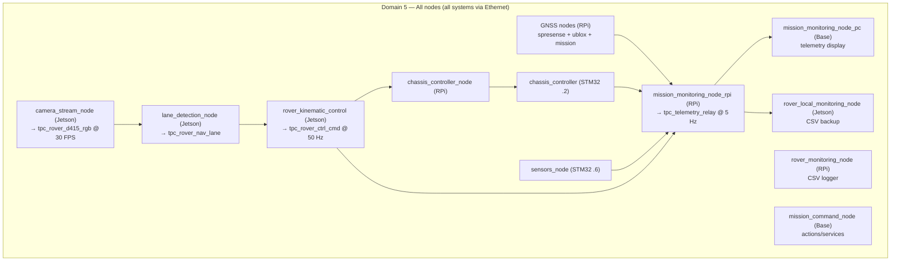

# ROS2 Domain Architecture

> **Branch: `single-domain`** — All workspaces run on **ROS_DOMAIN_ID=5**. This is a POC to evaluate the impact of collapsing D4+D5+D6 into a single domain. See the `multi-domain` branch for the original tri-domain architecture.

The rover uses a **single-domain architecture**: Domain 5 for all 16 nodes on all machines.

## Domain Assignment

| Domain | Purpose | Network Scope | Participants | Key Characteristics |
|--------|---------|---------------|--------------|---------------------|
| **5** | All communication | All rover systems | **~16 nodes:**<br>• RPi: 8 nodes<br>• Jetson: 4 nodes<br>• Base: 2 nodes<br>• STM32: 2 (chassis, sensors) | • All traffic on one domain<br>• Camera images traverse the network (no shared-memory isolation)<br>• STM32 sees all participants<br>• `SPDP_MAX_NUMBER_FOUND_PARTICIPANTS=30` (14 spare slots) |

## Architecture Overview



## Design Rationale

**Single-domain POC goal:** All D4+D5+D6 traffic collapsed to D5 to measure:
- STM32 SRAM impact (all ~16 participants visible vs ~12 in multi-domain)
- Message latency and jitter with camera images sharing the control network
- Socket buffer pressure on RPi and Jetson from high-bandwidth vision topics

**Key differences from multi-domain branch:**
- `mission_monitoring_node_rpi` — single context on D5 (no dual-context D5→D4 bridge)
- `rover_kinematic_control` — single context on D5 (no dual-context D6→D5 bridge)
- `rover_local_monitoring_node` and `mission_monitoring_node_pc` — both on D5
- Camera images (`tpc_rover_d415_rgb`, `tpc_rover_d415_depth`) traverse the network on D5 instead of staying on Jetson localhost via shared memory

## Node Inventory

| # | Node | Machine | Package | Description |
|---|------|---------|---------|-------------|
| 1 | `chassis_controller_node` | RPi | chassis_control | Receives `tpc_rover_ctrl_cmd`, publishes `tpc_chassis_cmd` to STM32 |
| 2 | `chassis_imu_node` | RPi | chassis_sensors | Subscribes `tpc_chassis_imu` from STM32, relays to monitoring |
| 3 | `chassis_sensors_node` | RPi | chassis_sensors | Subscribes `tpc_chassis_sensors` from STM32, relays to monitoring |
| 4 | `gnss_spresense_node` | RPi | gnss_navigation | Reads Spresense USB serial, publishes `tpc_gnss_spresense` @ 10 Hz |
| 5 | `gnss_ublox_node` | RPi | gnss_navigation | Reads u-blox RTK via STM32 UART, publishes `tpc_gnss_ublox` @ 10 Hz |
| 6 | `gnss_mission_monitor_node` | RPi | gnss_navigation | Waypoint nav state machine, action server `/des_data` |
| 7 | `mission_monitoring_node_rpi` | RPi | rover_monitoring | Aggregates D5 topics → `tpc_telemetry_relay` @ 5 Hz |
| 8 | `rover_monitoring_node` | RPi | rover_monitoring | CSV data logger, subscribes 8 topics |
| 9 | `camera_stream_node` | Jetson | vision_navigation | D415 RGB/depth @ 30 FPS, `device_serial` + `fallback_video` params |
| 10 | `lane_detection_node` | Jetson | vision_navigation | Lane feature extraction @ 25-30 FPS |
| 11 | `rover_kinematic_control` | Jetson | vision_navigation | Bicycle-model PID, pub `tpc_rover_ctrl_cmd` @ 50 Hz |
| 12 | `rover_local_monitoring_node` | Jetson | rover_monitoring | CSV backup logger, sub `tpc_telemetry_relay` @ 5 Hz |
| 13 | `mission_command_node` | Base | mission_control | Action client `/des_data`, service client `/srv_spd_limit` |
| 14 | `mission_monitoring_node_pc` | Base | mission_control | Telemetry display, sub `tpc_telemetry_relay` |
| 15 | STM32 chassis | 192.168.1.2 | mROS2 | Motor control + IMU publisher @ 10 Hz |
| 16 | STM32 sensors | 192.168.1.6 | mROS2 | Encoders + power + GNSS publisher @ 4 Hz |

## Domain Configuration

### Launching (all D5)

**ws_rpi (Raspberry Pi):**
```bash
cd ~/almondmatcha/ws_rpi
./launch_rover_single_domain.sh
```

**ws_jetson (Jetson):**
```bash
cd ~/almondmatcha/ws_jetson
./launch_jetson_single_domain.sh
```

**ws_base (Base Station):**
```bash
cd ~/almondmatcha/ws_base
./launch_base_single_domain.sh
```

**STM32 Firmware:**
```cpp
// In platform/rtps/config.h
const uint8_t DOMAIN_ID = 5;
```

## Verifying Configuration

```bash
export ROS_DOMAIN_ID=5
ros2 node list

# Expected (~16 nodes):
/chassis_controller_node        # RPi
/chassis_imu_node               # RPi
/chassis_sensors_node           # RPi
/gnss_spresense_node            # RPi
/gnss_ublox_node                # RPi
/gnss_mission_monitor_node      # RPi
/mission_monitoring_node_rpi    # RPi
/rover_monitoring_node          # RPi
/camera_stream_node             # Jetson
/lane_detection_node            # Jetson
/rover_kinematic_control        # Jetson
/rover_local_monitoring_node    # Jetson
/mission_command_node           # Base (if launched)
/mission_monitoring_node_pc     # Base (if launched)
/chassis_controller             # STM32 chassis
/sensors_node                   # STM32 sensors

ros2 topic hz /tpc_rover_ctrl_cmd     # ~50 Hz
ros2 topic hz /tpc_chassis_imu        # ~10 Hz
ros2 topic hz /tpc_telemetry_relay    # ~5 Hz
```

## Telemetry Relay

On this branch, `mission_monitoring_node_rpi` publishes `tpc_telemetry_relay` on **D5** (same domain as all other topics). Two subscribers consume it:

- **`mission_monitoring_node_pc` (Base):** real-time telemetry display
- **`rover_local_monitoring_node` (Jetson):** CSV backup at 5 Hz

Published at 5 Hz (~280 bytes/message) with aggregated fields: mission state, RTK/Spresense GNSS, chassis sensors, IMU, motor commands, lane detection, destination coordinates.

See [`common_ifaces/msgs_ifaces/msg/TelemetryRelay.msg`](../common_ifaces/msgs_ifaces/msg/) for full definition.

## Troubleshooting

**Base station sees no telemetry:**
1. `echo $ROS_DOMAIN_ID` on base — should be 5
2. RPi node running: `ros2 node list | grep mission_monitoring_node_rpi`
3. Network: `ping 192.168.1.1` from base

**STM32 not discovered:**
1. Check `ros2 node list` for `/chassis_controller` and `/sensors_node`
2. Verify `ping 192.168.1.2` and `ping 192.168.1.6`
3. Serial console: `minicom -D /dev/ttyACM0 -b 115200`

**High STM32 memory:**
`[MemoryPool] RESSOURCE LIMIT EXCEEDED` — check participant count:
```bash
ros2 node list | wc -l  # Should be ~16
```
Ensure no extra ros2 CLI tools or daemons are running that would exceed `SPDP_MAX=30`.

---

**See Also:** [ARCHITECTURE.md](ARCHITECTURE.md) · [TOPICS.md](TOPICS.md)
