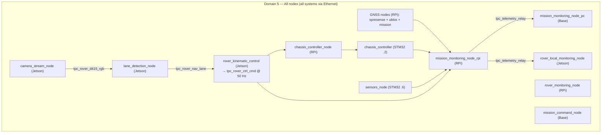

# ROS2 Domain Architecture

> **Branch: `single-domain`** — all workspaces on `ROS_DOMAIN_ID=5` (D4+D5+D6 collapsed). POC to measure the impact of domain consolidation. See the `multi-domain` branch for the baseline tri-domain architecture.

## Domain Assignment

| Domain | Purpose | Scope | Participants |
|--------|---------|-------|-------------|
| **5** | All communication | All systems via Ethernet | 16 nodes: RPi (8), Jetson (4), Base (2), STM32 chassis + sensors |

## Architecture

## Design Rationale

**Measurement goal:** Collapse D4+D5+D6 → D5 to quantify:
- STM32 SRAM impact (16 visible participants vs 11 in multi-domain)
- Message latency/jitter with camera images sharing the control network
- Socket buffer pressure on RPi and Jetson from high-bandwidth vision topics

**Key differences from `multi-domain`:**
- `SPDP_MAX_NUMBER_FOUND_PARTICIPANTS=30` (16 nodes + daemons + CLI + margin)
- Camera images (`tpc_rover_d415_rgb`) traverse the network — no shared-memory isolation
- All monitoring nodes on D5 (no D4 relay path)
- `rover_kinematic_control` — single D5 context (no dual-context bridge)

---

**See Also:** [ARCHITECTURE.md](ARCHITECTURE.md) · [TOPICS.md](TOPICS.md) · [CSV_LOGGING.md](CSV_LOGGING.md)
