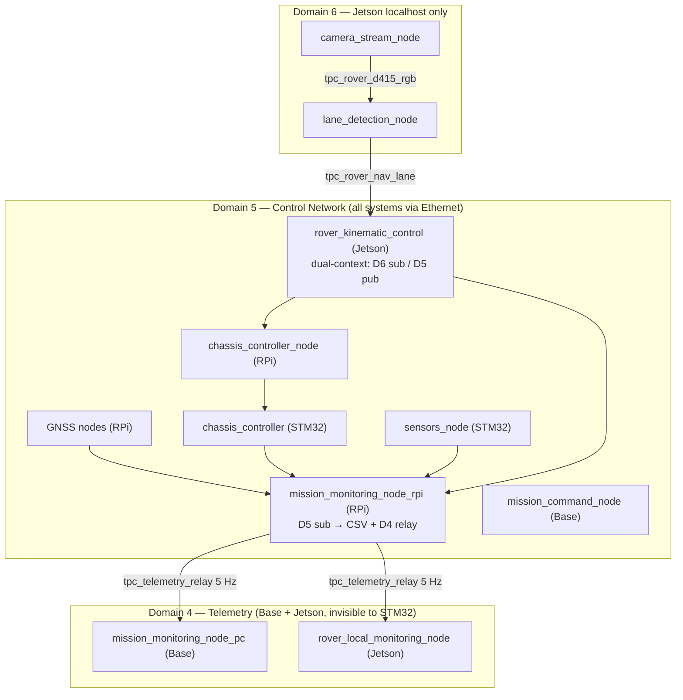

# ROS2 Domain Architecture

> **Branch: `multi-domain`** — Original tri-domain architecture: D4 (telemetry), D5 (control/STM32), D6 (vision). See `single-domain` for the all-D5 POC variant.

## Domain Assignment

| Domain | Purpose | Scope | Participants |
|--------|---------|-------|-------------|
| **4** | Telemetry relay | Base + Jetson | `mission_monitoring_node_pc` (Base), `rover_local_monitoring_node` (Jetson) — subscribe `/tpc_telemetry_relay` @ 5 Hz; invisible to STM32 |
| **5** | Control network | All systems via Ethernet | RPi (7 nodes), Base (`mission_command_node`), Jetson (`rover_kinematic_control`), STM32 (2 nodes) = **11 total** |
| **6** | Vision processing | Jetson localhost only | `camera_stream_node`, `lane_detection_node` — 30 FPS, never on network |

## Architecture

## Design Rationale

**D6 isolation (D5 count: 13→11):** Camera + lane-detection on Jetson localhost — 30 FPS RGB/depth traffic never hits the network or STM32 proxy slots.

**D4 relay (stable D5 count):** Monitoring-only nodes on D4 — zero STM32 RAM cost. `mission_monitoring_node_rpi` aggregates all D5 topics and relays a single `/tpc_telemetry_relay` to D4 at 5 Hz.

**Cross-domain links (no bridge process):**
- `rover_kinematic_control` — single process, two rclpy contexts (D6 sub + D5 pub)
- `mission_monitoring_node_rpi` — single process, two rclcpp contexts (D5 sub + D4 pub)

---

**See Also:** [ARCHITECTURE.md](ARCHITECTURE.md) · [TOPICS.md](TOPICS.md) · [CSV_LOGGING.md](CSV_LOGGING.md)
