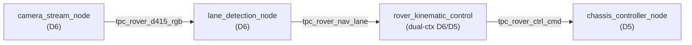
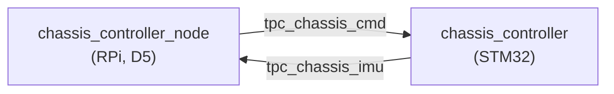
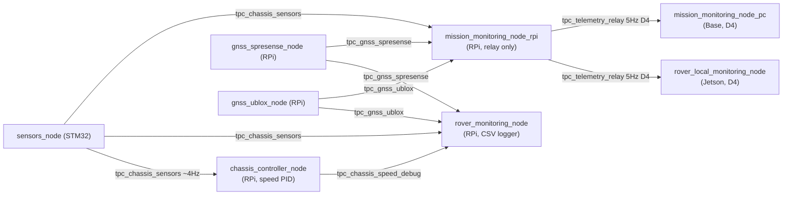

# ROS2 Topics Reference

Complete topic reference for Almondmatcha rover system.

**Domain Architecture:**
- **Domain 4 (Telemetry):** Base station + Jetson, subscribers to aggregated relay only
- **Domain 5 (Control):** Network-wide control topics visible to all systems
- **Domain 6 (Vision):** Jetson localhost vision topics (camera streams)

## Topic Naming Convention

- Prefix: `tpc_` (topic)
- Descriptive middle section
- Domain-specific topics noted in description

## Vision Topics (Jetson)

### `tpc_rover_d415_rgb`

**Type:** `sensor_msgs/msg/Image`  
**Publisher:** `camera_stream_node`  
**Subscribers:** `lane_detection_node`  
**Rate:** 30 FPS  
**QoS:** Best Effort, Depth 1  
**Domain:** 6 (Jetson localhost only)  

RGB image stream from Intel RealSense D415 camera (`rgb8`, 1280×720).

---

### `tpc_rover_d415_depth`

**Type:** `sensor_msgs/msg/Image`  
**Publisher:** `camera_stream_node`  
**Subscribers:** (reserved for obstacle avoidance)  
**Rate:** 30 FPS  
**QoS:** Best Effort, Depth 1  
**Domain:** 6 (Jetson localhost only)  

Depth image from RealSense D415 (`16UC1`, mm units). Not currently subscribed.

---

### `tpc_rover_nav_lane`

**Type:** `std_msgs/msg/Float32MultiArray`  
**Publisher:** `lane_detection_node` (Domain 6)  
**Subscribers:** `rover_kinematic_control`'s D6 context (`RoverKinematicControlNode`)  
**Rate:** 25-30 FPS  
**QoS:** Best Effort, Depth 10  
**Domain:** 6 only — **never crosses to Domain 5 or 4**

This topic is **Domain 6 only**, published and subscribed entirely within the Jetson's
vision domain. It is *not* a cross-domain topic and is never forwarded to D5 — the only
D6→D5 bridge in the system is `rover_kinematic_control`'s dual-context publish of its
*derived* `tpc_rover_ctrl_cmd` output (see below), not this raw lane data. RPi-side D5
nodes (`mission_monitoring_node_rpi`, `rover_monitoring_node`) deliberately do not
subscribe to this topic — they couldn't anyway, since DDS domain IDs are a hard
discovery partition (a D5 subscriber can't see a D6-only publisher regardless of
matching topic name/type). Raw lane data is logged only on the Jetson side, in
`ws_jetson_lane_detection_*.csv` (see [CSV_LOGGING.md](CSV_LOGGING.md)).

**Fields:**
```yaml
layout:
  dim: []
  data_offset: 0
data: [curvature, theta, b, detected]
```

**Data Array:**
- `data[0]` - **curvature:** Parabola coefficient A (`x = A*y² + B*y + C`), rover-centered frame
- `data[1]` - **theta (degrees):** Heading error angle
  - Positive: lane on right (need to turn right)
  - Negative: lane on left (need to turn left)
  - Range: typically -30° to +30°
- `data[2]` - **b (pixels):** Lateral offset from center
  - Positive: camera right of lane center
  - Negative: camera left of lane center
  - Range: -640 to +640 (half of image width)
- `data[3]` - **detected (0 or 1):** Lane detection confidence
  - 1.0: Lane detected successfully
  - 0.0: No lane detected

---

---

## Control Topics (Jetson/Base)

### `tpc_rover_ctrl_cmd`

**Type:** `std_msgs/msg/Float32MultiArray`  
**Publisher:** `rover_kinematic_control` (Jetson, dual-context D6→D5)  
**Subscribers:** `chassis_controller_node` (RPi)  
**Rate:** 50 Hz  
**QoS:** Best Effort, Depth 10  
**Domain:** 5  

Combined kinematic control output: steering angle and chassis speed from the bicycle-model PID controller. Published directly to Domain 5 by the dual-context `rover_kinematic_control` node (no bridge).

**Fields:**
```yaml
data: [steer_angle, speed_cmd, detected]
```

**Data Array:**
- `data[0]` - **steer_angle (degrees):** Commanded steering angle
  - Positive: turn right
  - Negative: turn left
  - Range: configurable (default ±60°)
- `data[1]` - **speed_cmd (0–100):** Chassis speed command in % PWM duty cycle
  - The STM32 converts: `motor_duty = speed_cmd / 100.0`
  - 100 = full throttle, 50 = half throttle, 0 = stopped
  - Detection-timeout logic applied here (caution/stop when lane lost)
- `data[2]` - **detected (0 or 1):** Lane detection validity flag (informational pass-through)

---

## Chassis Control Topics (RPi ↔ STM32)

### `tpc_chassis_cmd`

**Type:** `msgs_ifaces/msg/ChassisCtrl`  
**Publisher:** `chassis_controller_node`  
**Subscribers:** `chassis_controller` (STM32)  
**Rate:** 50 Hz  
**QoS:** Reliable, Depth 10  
**Domain:** 5  

Motor and steering commands to chassis controller.

**Message Definition:**
```
uint8 fdr_msg           # Front direction: 0=straight, 1=left, 2=right
float32 ro_ctrl_msg     # Steering angle in degrees (-45 to +45)
uint8 bdr_msg           # Back direction: 0=forward, 1=backward, 2=stop
uint8 spd_msg           # Motor speed 0-100%
```

**Example:**
```yaml
fdr_msg: 0
ro_ctrl_msg: 5.0        # 5° right turn
bdr_msg: 0              # Forward
spd_msg: 50             # 50% speed
```

---

### `tpc_chassis_imu`

**Type:** `msgs_ifaces/msg/ChassisIMU`  
**Publisher:** `chassis_controller` (STM32)  
**Subscribers:** `chassis_imu_node`, `node_ekf_fusion` (future)  
**Rate:** 10 Hz  
**QoS:** Reliable, Depth 10  
**Domain:** 5  

IMU sensor data from LSM6DSV16X (sampled at 100 Hz, published at 10 Hz).

**Message Definition:**
```
int32 accel_x          # Acceleration X-axis (raw sensor units)
int32 accel_y          # Acceleration Y-axis
int32 accel_z          # Acceleration Z-axis
int32 gyro_x           # Angular rate X-axis (raw sensor units)
int32 gyro_y           # Angular rate Y-axis
int32 gyro_z           # Angular rate Z-axis
```

**Unit Conversion (LSM6DSV16X):**
- Accel sensitivity: ±2g → 0.061 mg/LSB
- Gyro sensitivity: ±250 dps → 8.75 mdps/LSB

---

### `tpc_chassis_sensors`

**Type:** `msgs_ifaces/msg/ChassisSensors`  
**Publisher:** `sensors_node` (STM32)  
**Subscribers:** `chassis_sensors_node`, `chassis_controller_node` (closed-loop speed PID), `rover_monitoring_node` (CSV logging), `mission_monitoring_node_rpi` (D4 relay), `node_ekf_fusion` (future)  
**Rate:** 4 Hz (aggregated from 3 tasks)  
**QoS:** Best Effort, Volatile, Depth 10 (sensor_data profile — matches STM32 mbed default)  
**Domain:** 5  

Encoder, power, and GNSS data from sensors board. `chassis_controller_node` computes
ticks/sec from consecutive `mt_lf_encode_msg`/`mt_rt_encode_msg` deltas to drive a
speed PID, falling back to open-loop passthrough if this feed goes stale (see
[ws_rpi/docs/rover_bringup.md](../ws_rpi/docs/rover_bringup.md)). The raw counts here
are cumulative, not a rate — see `tpc_chassis_speed_debug` below for the actual
measured wheel speed the PID computes from them.

**Message Definition:**
```
int32 mt_lf_encode_msg     # Left encoder count
int32 mt_rt_encode_msg     # Right encoder count
float32 sys_volt_msg       # System voltage (V)
float32 sys_current_msg    # System current (A)
```

**Example:**
```yaml
mt_lf_encode_msg: 12345    # Left motor encoder count
mt_rt_encode_msg: 12340    # Right motor encoder count
sys_volt_msg: 12.5         # 12.5V battery
sys_current_msg: 2.3       # 2.3A draw
```

---

### `tpc_chassis_speed_debug`

**Type:** `std_msgs/msg/Float32MultiArray`  
**Publisher:** `chassis_controller_node`  
**Subscribers:** `rover_monitoring_node` (CSV logging only)  
**Rate:** ~4 Hz (paced by `tpc_chassis_sensors`, not independently timed)  
**QoS:** Best Effort, Volatile, Depth 10 (sensor_data profile, matches `tpc_chassis_sensors`)  
**Domain:** 5  

Closed-loop speed PID internals from `chassisSensorsCallback()` — otherwise computed
and discarded with no external trace. Added specifically so the speed PID
(`speed_kp`/`speed_ki`/`speed_kd` in `chassis_speed_control_params.yaml`) is tunable
from logs. See `chassis_speed_pid.csv` in [CSV_LOGGING.md](CSV_LOGGING.md).

**Fields:**
```yaml
data: [measured_left_tps, measured_right_tps, measured_avg_tps, target_tps, error, pid_output_pct]
```

**Data Array:**
- `data[0]` - **measured_left_tps:** Left wheel speed (ticks/sec), from encoder delta since the previous message
- `data[1]` - **measured_right_tps:** Right wheel speed (ticks/sec), same basis
- `data[2]` - **measured_avg_tps:** Average of left/right — the actual PID process variable
- `data[3]` - **target_tps:** Setpoint, `(target_speed_pct / 100) × max_ticks_per_sec`
- `data[4]` - **error:** `target_tps - measured_avg_tps`
- `data[5]` - **pid_output_pct:** PID output (0–100% duty) *before* the operator safety cap

---

## GNSS Navigation Topics (RPi)

### `tpc_gnss_spresense`

**Type:** `msgs_ifaces/msg/SpresenseGNSS`  
**Publisher:** `gnss_spresense_node`  
**Subscribers:** `gnss_mission_monitor_node`, `node_ekf_fusion` (future)  
**Rate:** 10 Hz  
**QoS:** Reliable, Depth 10  
**Domain:** 5  

GPS position data from Sony Spresense module.

**Message Definition:**
```
float64 latitude           # Decimal degrees (WGS84)
float64 longitude          # Decimal degrees (WGS84)
float64 altitude           # Meters above mean sea level
float32 accuracy           # Position accuracy (m)
uint8 fix_quality          # 0=no fix, 1=GPS, 2=DGPS, 3=RTK
uint8 num_satellites       # Number of satellites in view
```

**Example:**
```yaml
latitude: 7.007286
longitude: 100.502030
altitude: 15.5
accuracy: 2.5              # ±2.5m accuracy
fix_quality: 1             # Standard GPS fix
num_satellites: 8
```

---

### `tpc_gnss_ublox`

**Type:** `msgs_ifaces/msg/UbloxGNSS`  
**Publisher:** `gnss_ublox_node`  
**Subscribers:** `mission_monitoring_node_rpi`, `rover_monitoring_node`  
**Rate:** 10 Hz  
**QoS:** Reliable, Depth 10  
**Domain:** 5  

RTK GNSS position data from u-blox SimpleRTK2b module with centimeter-level accuracy.

**Message Definition:**
```
string date                # Date string (DDMMYY)
string time                # Time string (HHMMSS.SSS)
float64 latitude           # Decimal degrees (WGS84)
float64 longitude          # Decimal degrees (WGS84)
float64 altitude           # Meters above mean sea level
uint8 satellites_tracked   # Number of satellites tracked
uint8 fix_quality          # 0=invalid, 1=GPS, 2=DGPS, 4=RTK fixed, 5=RTK float
float32 snr                # Signal-to-noise ratio (dB)
float32 speed              # Ground speed (m/s)
float32 centimeter_error   # Estimated position error (cm)
```

**Example:**
```yaml
date: "110125"             # January 11, 2025
time: "143022.500"         # 14:30:22.500 UTC
latitude: 7.007286
longitude: 100.502030
altitude: 15.523           # Altitude with cm precision
satellites_tracked: 12
fix_quality: 4             # RTK fixed solution
snr: 42.5                  # Strong signal
speed: 0.05                # 5 cm/s (~stationary)
centimeter_error: 2.3      # ±2.3cm accuracy
```

---

### `tpc_gnss_mission_active`

**Type:** `std_msgs/msg/Bool`  
**Publisher:** `gnss_mission_monitor_node`  
**Subscribers:** `chassis_controller_node`  
**Rate:** 10 Hz  
**QoS:** Reliable, Depth 10  
**Domain:** 5  

Mission status flag (used for cruise control logic).

**Fields:**
```yaml
data: true    # Mission active
data: false   # Mission inactive or completed
```

---

### `tpc_gnss_mission_remain_dist`

**Type:** `std_msgs/msg/Float64`  
**Publisher:** `gnss_mission_monitor_node`  
**Subscribers:** Base station monitoring  
**Rate:** 10 Hz  
**QoS:** Reliable, Depth 10  
**Domain:** 5  

Remaining distance to waypoint in kilometers.

**Fields:**
```yaml
data: 0.125    # 125 meters to target
data: 0.0      # Arrived at waypoint
```

---

### `tpc_rover_dest_coordinate`

**Type:** `std_msgs/msg/Float64MultiArray`  
**Publisher:** Service response from `gnss_mission_monitor_node`  
**Subscribers:** Internal mission monitor use  
**Rate:** Event-driven  
**QoS:** Reliable, Depth 10  
**Domain:** 5  

Destination coordinates for navigation mission.

**Fields:**
```yaml
data: [latitude, longitude]
```

**Example:**
```yaml
data: [7.007286, 100.502030]    # Target waypoint in Thailand
```

---

## Actions and Services (Domain 5)

### `/des_data` (Action)

**Type:** `action_ifaces/DesData`  
**Client:** `mission_command_node` (ws_base)  
**Server:** `gnss_mission_monitor_node` (ws_rpi)  
**Domain:** 5  

Navigation goal action for waypoint missions.

**Goal:**
```yaml
float64 des_lat     # Target latitude
float64 des_long    # Target longitude
```

**Feedback:**
```yaml
float64 dis_remain  # Distance remaining (km)
```

**Result:**
```yaml
uint8 result_fser   # Result code
```

### `/srv_spd_limit` (Service)

**Type:** `services_ifaces/SpdLimit`  
**Client:** `mission_command_node` (ws_base)  
**Server:** `chassis_controller_node` (ws_rpi)  
**Domain:** 5  

Speed limit command service.

**Request:**
```yaml
uint8 rover_spd     # Speed safety cap (0–100% PWM duty cycle)
                    # STM32 converts: motor_duty = rover_spd / 100.0
                    # Values > 100 are meaningless (exceed 100% duty)
                    # Default at startup: 50 (conservative safe value)
```

**Response:**
```yaml
uint8 ack           # Acknowledgment
```

---

## Archived Topics (No Longer Used)

### `tpc_telemetry` (Removed)

This topic was planned for aggregated telemetry and has been superseded by `tpc_telemetry_relay` on Domain 4 (see below).

### `tpc_command` (Archived)

Commands from base station are sent directly via actions/services on Domain 5:
- Navigation goals: `/des_data` action
- Speed limits: `/srv_spd_limit` service

---

## Domain 4 Topics

### `tpc_telemetry_relay`

**Type:** `msgs_ifaces/msg/TelemetryRelay`  
**Publisher:** `mission_monitoring_node_rpi` (RPi, internal D4 context)  
**Subscribers:** `mission_monitoring_node_pc` (Base, display), `rover_local_monitoring_node` (Jetson, CSV)  
**Rate:** 5 Hz  
**QoS:** Reliable, Depth 10  
**Domain:** 4 (not visible from D5 or D6)

Aggregated rover state published from RPi to Domain 4. The RPi node subscribes to 9 Domain 5 topics and republishes aggregated data at 5 Hz to isolate monitoring traffic from the control network.

**Key Fields:**
- Mission: `mission_active`, `distance_remaining_km`
- RTK GNSS: `ublox_valid`, `ublox_latitude`, `ublox_longitude`, `ublox_altitude`, `ublox_fix_quality`, `ublox_centimeter_error`
- Spresense GNSS: `spresense_valid`, `spresense_latitude`, `spresense_longitude`, `spresense_altitude`
- Chassis: `encoder_left/right`, `voltage`, `current`, `power_watts`
- IMU: `accel_x/y/z`, `gyro_x/y/z`
- Commands: `chassis_cmd_left/right_speed/direction`
- Navigation: `steering_command`; `lane_theta`/`lane_b`/`lane_detected` are always `0`/`false` — raw lane data is Domain-6-only and never reaches this node (see `tpc_rover_nav_lane` above), fields stay in the schema for other consumers but are never populated here
- Destination: `destination_latitude`, `destination_longitude`

**Size:** ~280 bytes/message

See [msgs_ifaces/msg/TelemetryRelay.msg](../common_ifaces/msgs_ifaces/msg/) for complete definition.

---

## Topic Dependency Graph

**Vision Processing (Domain 6 → Domain 5):**


**Chassis Control (Domain 5):**


**Sensor Data Flow (Domain 5 → D4 relay + D5 CSV logging):**


---

## QoS Policy Summary

| Topic | Reliability | Durability | History | Depth |
|-------|-------------|-----------|---------|-------|
| `tpc_rover_d415_rgb` | Best Effort | Volatile | Keep Last | 1 |
| `tpc_rover_d415_depth` | Best Effort | Volatile | Keep Last | 1 |
| `tpc_rover_nav_lane` | Best Effort | Volatile | Keep Last | 10 |
| `tpc_rover_ctrl_cmd` | Best Effort | Volatile | Keep Last | 10 |
| `tpc_chassis_cmd` | Reliable | Volatile | Keep Last | 10 |
| `tpc_chassis_imu` | Reliable | Volatile | Keep Last | 10 |
| `tpc_chassis_sensors` | Best Effort | Volatile | Keep Last | 10 |
| `tpc_chassis_speed_debug` | Best Effort | Volatile | Keep Last | 10 |
| `tpc_gnss_*` | Reliable | Volatile | Keep Last | 10 |

**Rationale:**
- **Vision streams:** Best Effort for high throughput, low latency
- **Control/sensor data:** Reliable to ensure no command loss
- **History depth:** 10 for sensor data allows brief buffering during CPU spikes

---

## Message Interface Packages

All custom message types defined in `common_ifaces/`:

- **msgs_ifaces:** ChassisCtrl, ChassisIMU, ChassisSensors, SpresenseGNSS, UbloxGNSS, **TelemetryRelay**
- **action_ifaces:** DesData (navigation goals)
- **services_ifaces:** SpdLimit (speed limit updates)

Build order: `colcon build --packages-select action_ifaces msgs_ifaces services_ifaces`

---

**See Also:**
- [ARCHITECTURE.md](ARCHITECTURE.md) - System architecture
- [DOMAINS.md](DOMAINS.md) - Domain configuration details
