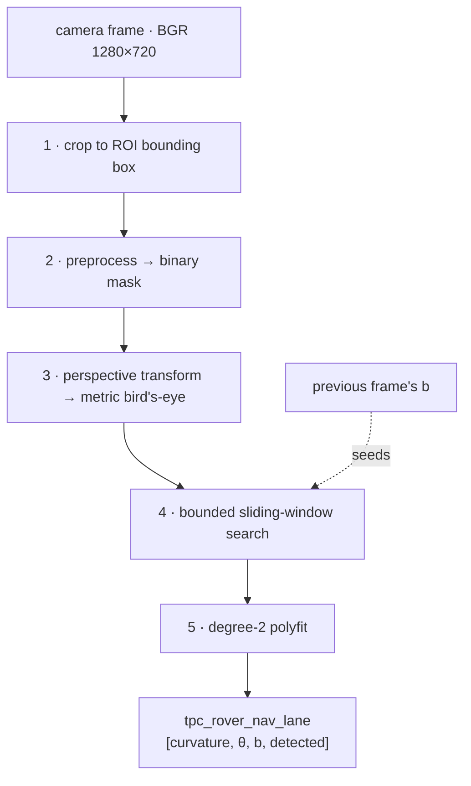

# Vision Pipeline

How a camera frame becomes the three numbers the steering loop consumes.
This document ends where [CONTROL_LAW.md](CONTROL_LAW.md) begins — at the
`tpc_rover_nav_lane` topic. For topic schemas see [TOPICS.md](TOPICS.md); for
domain topology see [ARCHITECTURE.md](ARCHITECTURE.md).

**Files:**
`ws_jetson/src/vision_navigation/vision_navigation/lane_detector.py` (the
pipeline itself, pure functions, no ROS) and `lane_detection_node.py` (the ROS
wrapper: parameters, frame-to-frame state, publishing, CSV logging).
`regenerate_roi.py` recomputes the §0/§1 geometry from the physical mount —
run it, don't hand-recompute, whenever the mount changes.
**Config:** `config/vision_nav_headless.yaml` / `config/vision_nav_gui.yaml`.

---

## Overview



The pipeline detects **one** painted line and reports where it is and which
way it runs. It does not identify *which* line it found — see
[§4](#4-bounded-sliding-window-search), which is the whole reason the search
is bounded.

---

## 0. Camera geometry

Everything downstream is derived from the physical mount, so this is the
first thing to re-check if the rover is rebuilt.

| Quantity | Value |
|---|---|
| Camera | Intel RealSense D415, **colour** stream (`rs.stream.color`) |
| Height above ground | 0.50 m |
| Tilt | 15° down from horizontal (±3° mounting tolerance — the geometry below uses the nominal 15°) |
| Lateral position | on the rover's lateral centreline |
| Longitudinal position | 8 cm **behind** the front axle |
| Wheelbase | 0.4875 m |
| Capture resolution | 1280 × 720 (16:9, so the full sensor FOV is used) |

A pixel `(u, v)` maps to a ground point `(X, Z)` — `X` lateral, `Z` forward
from the camera — by intersecting its ray with the ground plane:

$$
\mathbf{d}_c = \left(\tfrac{u-c_x}{f_x},\; \tfrac{v-c_y}{f_y},\; 1\right)
\qquad
\begin{aligned}
d_y &= \tfrac{v-c_y}{f_y}\cos\phi + \sin\phi \\
d_z &= -\tfrac{v-c_y}{f_y}\sin\phi + \cos\phi
\end{aligned}
\qquad
t = \frac{h}{d_y}
$$

giving `X = t·(u−c_x)/f_x` and `Z = t·d_z`, with `h = 0.50 m` and
`φ = 15°`. The horizon (where `d_y = 0`) sits at row **112 of 720** — the
lower ~78% of the frame is ground (at the previous 20° mount this was row 23;
the shallower tilt pushes the horizon further down the frame).

What the camera actually covers (recomputed with `regenerate_roi.py`; see
that script for the exact formulas used for this table):

| | row | distance ahead | ground width visible |
|---|---|---|---|
| bottom of frame | 720 | 0.68 m | 1.09 m |
| **ROI near edge** | 458 | **1.30 m** | 1.92 m |
| **ROI far edge** | 270 | **3.00 m** | 4.19 m |

> **Correction (2026-08-04):** the previous version of this table listed
> 1.43 m / 3.85 m for the ROI near/far edge widths. Those numbers belonged to
> a different distance (0.92 m — see the near-field example below) and were
> never valid for the actual ROI edges; the "why the ROI starts 1.30 m out"
> reasoning immediately below this table already used the correct **±0.96 m**
> figure (1.92 m total) for the near edge, so the two were self-contradictory.
> Recomputed and re-verified against the ROI corner pixel positions below.

> **Intrinsics caveat.** `f_x ≈ 924`, `f_y ≈ 925` at 1280×720 are derived from
> the datasheet FOV (69.4° × 42.5°), **not** read from the device.
> `camera_stream_node` opens the colour stream but never calls
> `get_intrinsics()`. If the real values differ by more than a few percent,
> every ROI corner below shifts. Reading them from the SDK and publishing a
> `CameraInfo` is the correct fix.

---

## 1. ROI and crop

**`get_scaled_roi_points()` → `crop_to_roi()`**

`roi_base_points` is a trapezoid authored at 1280×720 and scaled to the live
resolution at runtime. It is **not** hand-drawn — it is the image projection
of a ground **rectangle**:

```
X = -0.90 .. +0.90 m   (lateral, 1.80 m wide)
Z =  1.30 ..  3.00 m   (forward from the camera, 1.70 m deep)
     = 1.22 .. 2.92 m ahead of the front axle
```

which projects to `[39, 458, 1241, 458, 915, 270, 365, 270]`.

Because the source region is a true ground rectangle, the warp in
[§3](#3-perspective-transform--metric-birds-eye) is a genuine rectification:
parallel lines on the track stay parallel in the bird's-eye view.

The frame is then cropped to that trapezoid's bounding box plus
`crop_margin_px` (20 base px), which trims the unwanted surroundings *before*
the per-pixel work in §2 runs. At 960×540 that is 159k px instead of 518k.
Unlike lowering the capture resolution, cropping does not reduce pixel density
inside the ROI, so it costs no fitting accuracy.

> **Why the ROI starts 1.30 m out rather than at the rover.** Near-field
> width is FOV-limited: at 0.92 m the camera sees only 1.41 m across, which
> leaves ±9.5 cm of drift before an outer painted line falls outside the ROI.
> Moving the near edge to 1.30 m widens that to ±0.96 m of coverage and
> ±35 cm of drift budget, at no CPU cost. The price is that the reported
> geometry is a **lookahead** measurement (see [§5](#5-lane-fit)).
>
> These widths barely move with the mount's tilt angle (they were 1.43 m /
> 1.93 m respectively at the previous 20° tilt) — horizontal FOV is nearly
> independent of vertical pitch. What moves substantially with tilt is
> *which row* these distances land on (see the horizon-row and coverage-table
> changes above), which is why the ROI corner pixels needed recomputing even
> though the practical drift-budget conclusion barely changed.

### Regenerating the ROI

If the camera height, tilt, mount position, or lens changes, **run
`ros2 run vision_navigation regenerate_roi` (or
`python3 vision_navigation/regenerate_roi.py` directly)** — do not
hand-recompute. It takes the physical mount as CLI arguments (defaults to
the currently-shipped geometry) and prints the ROI corners, `k_ff`, the
horizon row, and the coverage table above, ready to paste into `config.py`
and both `vision_nav_*.yaml` files.

This replaced a hand-computation process: the ROI corners used to be
recomputed with a calculator and hand-typed into three files every time the
mount changed, which is exactly the kind of arithmetic that silently drifts
out of sync (see the corrected coverage-table numbers above — a
transcription error from an earlier hand-computation went unnoticed until
this pass cross-checked it against the script). The script implements the
same math the manual process used:

$$
u = c_x + f_x\frac{X}{h\sin\phi + Z\cos\phi}
\qquad
v = c_y + f_y\frac{h\cos\phi - Z\sin\phi}{h\sin\phi + Z\cos\phi}
$$

applied to the four ground corners in order
`[bottom-left, bottom-right, top-right, top-left]`, at the 1280×720
authoring base — see `ground_to_pixel()` / `compute_roi_points()` in the
script for the runnable version.

---

## 2. Preprocessing → binary mask

**`preprocess_frame()`** — operates on the cropped BGR frame, returns a
`uint8` mask of 0/1.

Tuned for the operating environment: a **red track surface with white painted
lines, surrounded by green**.

| Step | Operation | Purpose |
|---|---|---|
| 1 | `BGR → LAB`, zero pixels where `A < 120 & B > 130` | Removes green (grass, trees). Without it the background dominates the gradient signal. |
| 2 | `LAB → RGB → grayscale` | Gradient input, with green already suppressed |
| 3 | Sobel x and y, `CV_32F`, k=3 | Edge response |
| 4 | `gradx`, `grady`: keep `50 ≤ \|S\| ≤ 100` | Directional edges of the right strength |
| 5 | `cv2.cartToPolar` → magnitude + direction | Magnitude and angle in one pass |
| 6 | `mag_binary`: normalise to 0–255, keep `30 ≤ m ≤ 100` | Edge strength band |
| 7 | `dir_binary`: keep `0.7 ≤ θ ≤ 1.3` rad | Roughly-vertical edges (lines run away from the camera) |
| 8 | `white_binary`: `gray > 180` | Direct white-paint detection — carries most of the signal |
| 9 | Combine: `(gradx & grady) \| (mag_binary & dir_binary) \| white_binary` | Union of the three cues |
| 10 | 3×3 `MORPH_OPEN` | Speckle removal |

**On step 10:** this replaced an older per-contour `contourArea < 100` filter.
They are not equivalent — the old test filtered on *area* (deleting compact
blobs up to ~11×11 while keeping thin lines), the opening filters on
*thickness* (keeping any blob ≥3×3 while deleting anything thinner than 3 px).
It is safe here because a 5 cm painted line images ~12 px wide even at the far
edge of the ROI (3.0 m), so the opening cannot erode it. **On a track with
narrower paint, re-check this.**

`LaneDetectionConfig.MIN_CONTOUR_AREA` is retained only as a record of the old
threshold; nothing reads it.

---

## 3. Perspective transform → metric bird's-eye

**`perspective_transform()`**

The ROI trapezoid is mapped onto a **fixed** canvas (`bev_width_px` ×
`bev_height_px` = 720 × 340), *not* onto the crop dimensions. The ROI occupies
the middle 50% of the canvas width (`PERSPECTIVE_LEFT/RIGHT_MARGIN` = 0.25 /
0.75), so:

$$
S = \frac{0.5 \cdot 720\ \text{px}}{1.80\ \text{m}}
  = \frac{340\ \text{px}}{1.70\ \text{m}}
  = 200\ \text{px/m in both axes}
$$

**Isotropy is the point.** Sizing the canvas from the crop made the view
2.45× wider than tall per metre, which meant `theta` was not an angle at all
but a canvas-dependent number inflated by the aspect ratio — and its scale
changed silently whenever the ROI or the resolution was edited. With
`BEV_PX_PER_M` fixed:

| Signal | Physical meaning |
|---|---|
| `theta` | real heading angle, degrees |
| `b` | real cross-track offset — **100 px = 50 cm** |
| `curvature` | real arc: `A = 1/(2·R·S)`, so `R = 1/(2·A·S)` |

This is also what makes the downstream clamps in `rover_kinematic_control`
meaningful: `θ ∈ [−35°, 35°]` is now ±35 real degrees, and
`b ∈ [−100, 100] px` is ±50 cm.

The canvas extends to ±1.8 m of ground even though the ROI spans ±0.9 m —
the homography is valid across the whole ground plane, so the extra margin
gives the search room to follow a line the rover has drifted away from.

---

## 4. Bounded sliding-window search

**`find_center_line()`**

Nine windows stacked bottom-to-top, each `±window_margin` wide. A window
recenters on the mean x of the pixels it contains if it has more than
`min_window_pixels`; otherwise it holds position and the next window up
starts from the same column.

The **start column** is the strongest column of the bottom-half histogram —
but only within `search_band_px` of `search_center`, which
`lane_detection_node` supplies as the previous frame's result:

```python
search_center = bev_width_px / 2 + b_previous     # detected frame
search_center = None  ->  canvas centre           # lost frame, or startup
```

### Why the search is bounded

This is the single most important constraint in the pipeline. The track has
**three parallel painted lines** — two lane edges and a centre line, 0.61 m
apart for a 1.22 m lane. The detector has no concept of *which* line it is
looking at; an unrestricted `argmax` simply picks whichever carries the most
pixels that frame.

Measured on a ground-truth render with the rover perfectly centred on the
middle line, the three histogram peaks came out at **35.2% / 32.5% / 32.3%** —
a 2.7-point margin deciding which line the rover follows. Lighting, paint
wear, or the rover's own drift flips it, and each flip is a step change in `b`
of one line spacing (measured: **222 px from a 15 px real movement**), which
saturates the downstream `clamp(b, ±100)` into a hard steering command. No
low-pass filter can absorb it, because it is a genuine step and not noise.

### Two hard constraints

Both are ceilings, not preferences. Both scale with `BEV_PX_PER_M`.

```
line spacing at 200 px/m  =  0.61 m × 200  =  122 px

window_margin   < 61   (half the spacing)   -> shipped: 40
search_band_px  < 61   (half the spacing)   -> shipped: 45
```

- **`window_margin` above half the spacing** lets one window capture two lines
  at once; `current_x = mean(x)` then lands in the empty gap between them and
  the fit is polluted by both.
- **`search_band_px` above half the spacing** lets the start-of-search
  histogram reach a neighbouring line, which is the wrong-line failure above.

`search_band_px` doubles as a rate limiter: the tracked line can appear to
move at most 45 px (22 cm) per frame, i.e. 6.7 m/s of lateral tracking at
30 fps.

> **If the lane width changes, recompute both.** They are the only two
> parameters in the pipeline with a hard correctness ceiling rather than a
> tuning range.

**`max_abs_b_px` (absolute plausibility bound, 100 px).** The per-frame
rate limit above stops jumps but not a steady walk: a field log showed `b`
creeping from -46 to -230 px over 19 frames while `detected` stayed true
throughout, ending 1.9 line spacings off and outside the ROI. `lane_detection_node`
now rejects any frame where `|b| > max_abs_b_px` — forcing `detected = false`
and letting the seed reset re-acquire from the canvas centre — since 100 px
(0.50 m) is also the downstream `rover_kinematic_control` clamp, past which
the value cannot reach the controller unsaturated regardless of cause.

---

## 5. Lane fit

**`compute_lane_params()`**

Detected pixels are shifted into a frame with `y = 0` at the canvas bottom row
and `x = 0` at the canvas centre column, then fitted with a degree-2
polynomial:

$$
x = A y^2 + B y + C
$$

Fitting *in that frame* means the coefficients are directly the quantities the
controller needs, with no separate "evaluate the polynomial at `y = height`"
step:

| Output | From | Meaning |
|---|---|---|
| `curvature` | `A` | arc of the lane, `R = 1/(2·A·S)` |
| `theta` | `degrees(arctan(B))` | heading angle of the lane |
| `b` | `C` | cross-track offset, px (200 px/m) |
| `detected` | `len(x) ≥ min_lane_pixels` | validity |

`detected = False` publishes `curvature = theta = b = 0.0`. **NaN is never put
on the wire** — see the `fecfeb4` note in [CONTROL_LAW.md](CONTROL_LAW.md);
`clamp(NaN, -100, 100)` used to collapse to `-100`, turning every undetected
frame into a full-scale left steering command.

### `b` is a lookahead measurement

`y = 0` is the **near edge of the ROI**, which is 1.30 m ahead of the camera
= **1.22 m ahead of the front axle** — not the rover itself. So `b` is the
cross-track error at a point ahead of the rover, which on a curve is non-zero
even when the rover is perfectly on the line.

That is a usable, pure-pursuit-like signal, but it means `b` and `curvature`
encode partly the same information. **When tuning, set `k_ff = 0` and tune
`k_p` on `theta` first, then add `k_e2`, then `k_ff`** — otherwise the lateral
and feedforward terms fight each other.

---

## Output contract

`tpc_rover_nav_lane` (`std_msgs/Float32MultiArray`, Domain 6,
Jetson-localhost only):

```
[0] curvature   float32   A coefficient, 1/(2·R·200)
[1] theta       float32   degrees
[2] b           float32   pixels, 200 px/m
[3] detected    float32   1.0 / 0.0
```

Also logged per frame to `<ws_jetson>/runs/run_NNN_<stamp>/lane_detection.csv`
as `timestamp, curvature, theta, b, detected, fps`, written on a background
thread so the image callback never blocks on disk. `fps` is measured
throughput over a 30-frame rolling window, not the configured capture rate.

---

## Parameter reference

`lane_detection` block of `vision_nav_headless.yaml` / `vision_nav_gui.yaml`.
Defaults live in `LaneDetectionConfig` (`vision_navigation/config.py`) and are
kept in sync.

| Parameter | Value | Notes |
|---|---|---|
| `roi_base_points` | `[39,458, 1241,458, 915,270, 365,270]` | Derived from the mount — regenerate with `regenerate_roi.py`, don't hand-edit |
| `roi_base_width` / `_height` | 1280 / 720 | Authoring base for the above |
| `crop_margin_px` | 20.0 | Trims unwanted surroundings, in base units |
| `bev_width_px` / `bev_height_px` | 720 / 340 | Fixes the scale at 200 px/m |
| `sliding_windows` | 9 | Window height = 340/9 ≈ 38 px |
| `window_margin` | 40 | **Hard ceiling 61** — half the line spacing |
| `search_band_px` | 45.0 | **Hard ceiling 61** — half the line spacing |
| `min_window_pixels` | 50 | Recenter threshold |
| `min_lane_pixels` | 50 | Validity threshold |
| `max_abs_b_px` | 100.0 | Absolute plausibility bound on fitted `b`; past it the frame is rejected (`detected` forced false) and the seed resets |

---

## Verification

> **Needs re-running against the current mount.** The results below were
> measured against a ground-truth render built from the *previous* geometry
> (50 cm height, 20° tilt, 7 cm behind the front axle). The mount has since
> moved to 15°±3° tilt, 8 cm behind the front axle (§0) — the render, and
> everything in this section, should be redone against the new geometry
> before being trusted as a validation of the current ROI. The pipeline
> logic itself (§§1–5) did not change, only the physical constants, so the
> *method* here is still correct; only the specific numbers below are stale.

Measured against a ground-truth render built from the §0 geometry — lines
placed at known ground coordinates, then projected into the image:

| Check | Result |
|---|---|
| `b` vs true cross-track offset | accurate to **2 mm** over ±30 cm |
| `theta` on a straight, centred lane | **0.00–0.18°** (no residual bias) |
| Fitted radius, true `R` = 36.5 / 20 / 10 m | **37.0 / 19.7 / 10.0 m** |
| `theta` on a bend, `R` = 36.5 m | −2.01° (geometric truth −2.04°) |
| Wrong-line lock-on, −50→+50→−50 cm sweep, 43 frames | **0 frames** on the wrong line |
| Cold-start acquisition range | ±25 cm; ±30 cm reports *not detected* |

---

## Known limits

- **Cold start beyond ±25 cm** of the centre line can latch onto a boundary
  line. The seed resets on every lost frame, so a lost-then-reacquire while
  badly off-centre is the exposure. At ±30 cm the failure is safe (*not
  detected*); beyond ±40 cm it can acquire the wrong line. Start the rover
  within ~20 cm of the centre line. Measured at the previous 20° mount; since
  the near-field ground width barely changes with tilt (see §1), this is
  likely still close, but hasn't been re-measured at the current 15° mount.
- **Intrinsics are assumed, not measured** (§0). The highest-value
  pre-run check is to launch with `vision_nav_gui.yaml` and confirm the ROI
  trapezoid lands on the track with all three lines inside it — that
  validates the intrinsics and the mount angle together.
- **The pipeline tracks one line.** Using all three (fitting each and taking
  the midpoint of the two edges) would be substantially more robust and would
  degrade gracefully under occlusion, but is not implemented.
- **`demo_lane.py` is not this pipeline.** It carries its own independent
  `process_frame` and homography and does not reflect node behaviour.
- **Thresholds in §2 are environment-specific.** The LAB green mask and the
  `gray > 180` white threshold assume a red track, white paint, green
  surroundings, and outdoor lighting.
